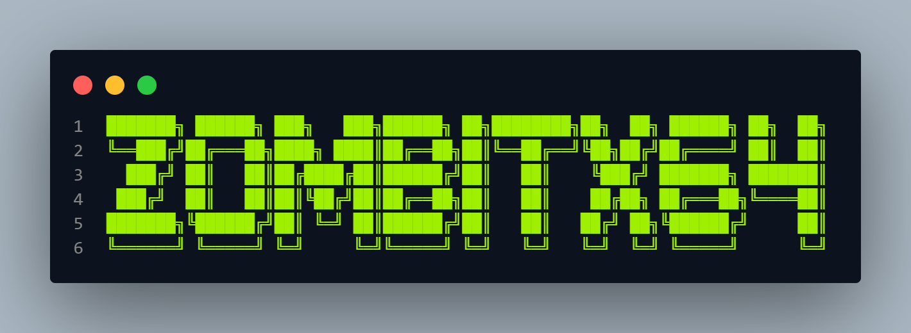

# 📚 AI LLM Learning Resources

# Notebook Git Colab อัพเดทข้อมูล เมื่อ วันที่ 7/3/2025

## 📑 สารบัญ

| ลำดับ | หัวข้อ                                                                                                 |
| :---- | :----------------------------------------------------------------------------------------------------- |
| 1     | [📘 พื้นฐานที่จำเป็น](#section1)                                                                         |
| 2     | [🛠️ วิศวกร LLM](#section3)                                                                             |
| 3     | [📚 สคริปต์และ Repository ขั้นสูง](#section4)                                                              |
| 4     | [🌐 การประยุกต์ใช้ LLM ในโลกจริงและเทรนด์อนาคต](#section5)                                                |
| 5     | [📖 ศัพท์ที่ต้องรู้ในวงการ LLM](#section6)                                                                 |
| 6     | [📂 ไฟล์ตัวอย่างและลิงก์ที่เกี่ยวข้องกับ LLM](#section7)                                                  |
| 7     | [🚀 การ Deploy LLM ใน Production](#section8)                                                            |
| 8     | [📄 งานวิจัยเกี่ยวกับ LLM](#section9)                                                                   |
| 9     | [🔧 หลักการและเทคนิคที่เกี่ยวข้อง](#section10)                                                            |
| 10    | [🎯 การเลือกใช้ Model และ Dataset](#section11)                                                           |
| 11    | [⚙️ การติดตั้งและการเตรียมระบบ](#section12)                                                              |
| 12    | [💻 การใช้งานและการจัดการ LLM](#section13)                                                               |
| 13    | [🌟 แหล่งข้อมูลโค้ดสำคัญ เทคนิคใหม่ และเทรนด์ใหม่](#section14)                                              |

---

## 📘 ส่วนที่ 1: พื้นฐานที่จำเป็น
- [1.1 คณิตศาสตร์สำหรับ Machine Learning](#math-ml)
- [1.2 การเขียนโปรแกรม Python](#python-prog)
- [1.3 โครงข่ายประสาทเทียม](#neural-networks)
- [1.4 การประมวลผลภาษาธรรมชาติ](#nlp)
- [1.5 แนวทางการเรียนรู้](#learning-path-1)

## 🛠️ ส่วนที่ 3: วิศวกร LLM
- [3.1 การสร้างแอปพลิเคชันด้วย LLMs](#llm-apps)
- [3.2 การเพิ่มประสิทธิภาพและความเร็วของ LLM](#llm-optimization)
- [3.3 ความปลอดภัยของ LLM](#llm-security)
- [3.4 แนวทางการเรียนรู้](#learning-path-3)

## 📚 ส่วนที่ 4: สคริปต์และ Repository ขั้นสูง
- [4.1 DeepSeek AI Repositories](#deepseek)
- [4.2 Uncensored AI Models](#uncensored-models)
- [4.3 Fine-Tuning Tables](#fine-tuning)
- [4.4 Awesome Colab Notebooks](#colab-notebooks)
- [4.5 Research Papers](#research-papers)
- [4.6 Additional Learning Resources](#additional-resources)

## 🌐 ส่วนที่ 5: การประยุกต์ใช้ LLM ในโลกจริง
- [5.1 โปรเจกต์ตัวอย่างที่ใช้ LLM](#llm-projects)
- [5.2 การวัดผลและปรับปรุง LLM](#llm-evaluation)
- [5.3 เทรนด์และนวัตกรรมใหม่](#emerging-trends)
- [5.4 แนวทางการเรียนรู้](#learning-path-5)

## 📖 ส่วนที่ 6: ศัพท์ที่ต้องรู้ในวงการ LLM
- [6.1 ศัพท์พื้นฐาน](#basic-terms)
- [6.2 ศัพท์เกี่ยวกับเทคนิคและวิธีการ](#technical-terms)
- [6.3 ศัพท์เกี่ยวกับประสิทธิภาพ](#performance-terms)
- [6.4 ศัพท์เกี่ยวกับความปลอดภัย](#security-terms)
- [6.5 ศัพท์เกี่ยวกับการวัดผล](#evaluation-terms)
- [6.6 แนวทางการเรียนรู้ศัพท์](#learning-terms)

## 📂 ส่วนที่ 7: ไฟล์ตัวอย่างและลิงก์ที่เกี่ยวข้อง
- [7.1 Colab Notebooks สำหรับ LLM](#colab-examples)
- [7.2 สคริปต์จาก GitHub](#github-scripts)
- [7.3 ชุดข้อมูลและไฟล์ที่เกี่ยวข้อง](#datasets)
- [7.4 โมเดลที่ดาวน์โหลดได้](#pretrained-models)
- [7.5 ลิงก์โปรเจกต์และเครื่องมือ](#tools-links)
- [7.6 แนวทางการใช้งาน](#usage-guidelines)
- [7.3 ชุดข้อมูลและไฟล์ที่เกี่ยวข้อง](#datasets)
- [7.4 โมเดลที่ดาวน์โหลดได้](#pretrained-models)
- [7.5 ลิงก์โปรเจกต์และเครื่องมือ](#tools-links)
- [7.6 แนวทางการใช้งาน](#usage-guidelines)

## ส่วนที่ 8: การ Deploy LLM ใน Production 🚀
- [8.1 เครื่องมือสำหรับ Deployment](#deployment-tools)
- [8.2 ขั้นตอนการ Deploy](#deployment-steps)
- [8.3 ตัวอย่าง Deployment](#deployment-examples)
- [8.4 แนวทางการเรียนรู้](#learning-path-8)

## ส่วนที่ 9: งานวิจัยเกี่ยวกับ LLM 📄
- [9.1 งานวิจัยพื้นฐาน](#foundational-papers)
- [9.2 งานวิจัยการฝึกและปรับปรุง](#training-papers)
- [9.3 งานวิจัยการประเมินผล](#evaluation-papers)
- [9.4 งานวิจัยความปลอดภัย](#security-papers)
- [9.5 งานวิจัยล่าสุด](#recent-papers)
- [9.6 แนวทางการศึกษา](#research-path)

## ส่วนที่ 10: หลักการและเทคนิคที่เกี่ยวข้อง 🔧
- [10.1 หลักการพื้นฐาน](#core-principles)
- [10.2 วิธีการ](#methodologies)
- [10.3 เทคนิคพิเศษ](#special-techniques)
- [10.4 เครื่องมือ](#tools)
- [10.5 Framework](#frameworks)
- [10.6 แนวทางการใช้งาน](#framework-usage)

## ส่วนที่ 11: การเลือกใช้ Model และ Dataset 🎯
- [11.1 การเลือกใช้ Model AI](#model-selection)
- [11.2 การเลือกใช้ Dataset](#dataset-selection)
- [11.3 ความหมายอื่นๆ ที่ต้องรู้](#other-concepts)
- [11.4 ลิงก์และแหล่งข้อมูล](#resources)
- [11.5 แนวทางการเลือกและใช้งาน](#selection-guidelines)

## ⚙️ ส่วนที่ 12: การติดตั้งและการเตรียมระบบ
- [12.1 การติดตั้ง Dependencies](#dependencies)
  - Python และ Package Manager
  - CUDA และ GPU Drivers
  - Framework ที่จำเป็น
- [12.2 การเตรียม Environment](#environment-setup)
  - Virtual Environment
  - Docker Container
  - Cloud Environment
- [12.3 การจัดการหน่วยความจำ](#memory-management)
  - RAM Optimization
  - GPU Memory Management
  - Disk Space Requirements
- [12.4 การตั้งค่าระบบ](#system-config)
  - Operating System
  - Network Configuration
  - Security Settings
- [12.5 Troubleshooting Guide](#troubleshooting)
  - Common Issues
  - Solutions
  - Support Resources

## 💻 ส่วนที่ 13: การใช้งานและการจัดการ LLM
- [13.1 Command Line Interface](#cli-usage)
  - Basic Commands
  - Advanced Operations
  - Automation Scripts
- [13.2 API Integration](#api-integration)
  - REST API
  - WebSocket
  - GraphQL
- [13.3 Monitoring & Logging](#monitoring)
  - Performance Metrics
  - Error Tracking
  - Usage Statistics
- [13.4 Resource Management](#resource-management)
  - Load Balancing
  - Scaling
  - Backup & Recovery
- [13.5 Best Practices](#best-practices)
  - Code Style
  - Documentation
  - Testing Strategy

## 🌟 ส่วนที่ 14: แหล่งข้อมูลโค้ดสำคัญ เทคนิคใหม่ และเทรนด์ใหม่
- [14.1 แหล่งข้อมูลโค้ดสำคัญ](#resources-code)
- [14.2 เทคนิคใหม่](#new-techniques)
- [14.3 เทรนด์ใหม่](#new-trends)
- [14.4 ลิงก์และแหล่งข้อมูลเพิ่มเติม](#additional-resources)
- [14.5 แนวทางการใช้งาน](#usage-guidelines)

# Notebook-Git-Colab อัพเดทข้อมูล เมื่อ วันที่ 7/3/2025

# สำหรับใครที่ยังต้อง Old version สามารถเข้าไปดูได้ที่ READMEOLD ที่โฟร์เดอร์ ReadmeCrack

*ส่วนนี้เหมาะสำหรับผู้เริ่มต้นที่ต้องการสร้างรากฐานที่มั่นคงในคณิตศาสตร์, Python, โครงข่ายประสาทเทียม และ NLP ก่อนที่จะศึกษาเทคนิคขั้นสูง*

### 1.1 คณิตศาสตร์สำหรับ Machine Learning

| แหล่งข้อมูล                                    | คำอธิบาย                                                                                                   | หัวข้อย่อย (Subtopics)                                                                    | ระดับ (Level)     | ลิงก์                                                                                                                              |
| :------------------------------------------- | :------------------------------------------------------------------------------------------------------------ | :----------------------------------------------------------------------------------------- | :---------------- | :-------------------------------------------------------------------------------------------------------------------------------- |
| 3Blue1Brown - Linear Algebra                 | ชุดวิดีโอสอนที่ใช้ภาพเคลื่อนไหวอธิบายพีชคณิตเชิงเส้น เหมาะสำหรับเห็นภาพคอนเซปต์ยากๆ เช่น การแปลงเมทริกซ์หรือค่าเจาะจงที่ใช้ใน PCA | เวกเตอร์, เมทริกซ์, การแปลง (transformations), ค่าเจาะจง (eigenvalues - ใช้ใน PCA), เวกเตอร์เจาะจง (eigenvectors - ใช้ใน SVD) | `[Beginner]`      | [YouTube Playlist](https://www.youtube.com/playlist?list=PLZHQObOWTQDPD3MizzM2xVFitgF8hE_ab)                                     |
| Khan Academy - Probability and Statistics    | คอร์สออนไลน์ฟรี สอนความน่าจะเป็นและสถิติพื้นฐานที่จำเป็นสำหรับ ML เช่น การแจกแจงที่ใช้ในโมเดลหรือการทดสอบสมมติฐาน | ความน่าจะเป็น, การแจกแจง (distributions), การทดสอบสมมติฐาน, การอนุมานแบบเบย์ (Bayesian inference)      | `[Beginner/Intermediate]` | [Khan Academy Course](https://www.khanacademy.org/math/statistics-probability)                                                     |
| Mathematics for Machine Learning (MML)       | หนังสือเรียนฟรีจาก Cambridge อธิบายคณิตศาสตร์ที่ใช้ใน ML อย่างละเอียด เช่น การหาค่าเหมาะที่สุดสำหรับ gradient descent | พีชคณิตเชิงเส้น, แคลคูลัส, ความน่าจะเป็น, การหาค่าเหมาะที่สุด (optimization)                        | `[Intermediate/Advanced]` | [MML Book](https://mml-book.github.io/)                                                                                       |
| All of Statistics (Wasserman)                | หนังสืออ้างอิงสถิติฉบับสมบูรณ์ เหมาะสำหรับผู้ที่ต้องการเจาะลึก เช่น การวิเคราะห์อนุกรมเวลาใน ML หรือการถดถอยขั้นสูง | การอนุมานทางสถิติ (statistical inference), การทดสอบสมมติฐาน, การถดถอย (regression), อนุกรมเวลา (time series) | `[Advanced]`      | [All of Statistics Book](https://www.stat.cmu.edu/~larry/all-of-statistics/) หรือ [Springer Link](https://link.springer.com/book/10.1007/978-0-387-21736-9) |

### 1.2 การเขียนโปรแกรม Python

| แหล่งข้อมูล                                  | คำอธิบาย                                                                                          | หัวข้อย่อย (Subtopics)                                                                       | ระดับ (Level)        | ลิงก์                                                                                                |
| :------------------------------------------- | :-------------------------------------------------------------------------------------------------- | :----------------------------------------------------------------------------------------- | :------------------- | :-------------------------------------------------------------------------------------------------- |
| Python Official Documentation              | เอกสารอ้างอิงอย่างเป็นทางการของ Python อ่านเพื่อเข้าใจพื้นฐานและโมดูลที่ใช้บ่อยใน ML เช่น `random` หรือ `math` | ไวยากรณ์ (syntax), โครงสร้างข้อมูล, โมดูล (modules), ไลบรารีมาตรฐาน (standard library)               | `[All Levels]`   | [Python Docs](https://docs.python.org/3/)                                                               |
| Google's Python Class                      | คอร์สฟรีจาก Google สอน Python พื้นฐาน เหมาะสำหรับผู้เริ่มต้นที่อยากฝึกเขียนโค้ดจริง เช่น การจัดการไฟล์ | พื้นฐาน, สตริง (strings), ลิสต์ (lists), ดิกชันนารี (dictionaries), ไฟล์, regular expressions      | `[Beginner]`       | [Google's Python Class](https://developers.google.com/edu/python/)                                      |
| Corey Schafer - Python Tutorials           | ช่อง YouTube สอน Python เชิงลึก เหมาะสำหรับการเรียนรู้ OOP และงาน data science เช่น การใช้ pandas | พื้นฐาน, การเขียนโปรแกรมเชิงวัตถุ (OOP), การพัฒนาเว็บ, วิทยาศาสตร์ข้อมูล (data science)            | `[Beginner/Intermediate]` | [Corey Schafer YouTube](https://www.youtube.com/c/Coreymschafer)                                        |
| Sentdex - Python Programming Tutorials     | ช่อง YouTube สอน Python แบบประยุกต์ เช่น การสร้างโมเดล ML หรือวิเคราะห์ข้อมูลด้วย NumPy          | Machine Learning, การวิเคราะห์ข้อมูล, การพัฒนาเว็บ, การพัฒนาเกม                                 | `[Intermediate]`    | [Sentdex YouTube](https://www.youtube.com/c/sentdex)                                                 |
| Python for Data Analysis (Wes McKinney)    | หนังสือสอนการใช้ Python (เน้น pandas) สำหรับการวิเคราะห์ข้อมูล เหมาะสำหรับงาน ML และ data science   | pandas, NumPy, การจัดการข้อมูล, การทำความสะอาดข้อมูล, การแสดงภาพข้อมูล (data visualization)     | `[Intermediate/Advanced]` | [Python for Data Analysis](https://wesmckinney.com/book/)                                               |
| Automate the Boring Stuff with Python      | หนังสือและคอร์สฟรี สอน Python พื้นฐานผ่านโปรเจกต์จริง เช่น อัตโนมัติงานเอกสาร เหมาะสำหรับผู้เริ่มต้น   | พื้นฐาน, การจัดการไฟล์, การ scraping เว็บ, การทำงานกับ Excel                                 | `[Beginner]`        | [Automate the Boring Stuff](https://automatetheboringstuff.com/)                                       |

### 1.3 โครงข่ายประสาทเทียม (Neural Networks)

| แหล่งข้อมูล                                    | คำอธิบาย                                                                                                | หัวข้อย่อย (Subtopics)                                                                                   | ระดับ (Level)          | ลิงก์                                                                                                                   |
| :------------------------------------------- | :--------------------------------------------------------------------------------------------------------- | :------------------------------------------------------------------------------------------------------- | :--------------------- | :--------------------------------------------------------------------------------------------------------------------- |
| DeepLearning.AI - Deep Learning Specialization | ชุดคอร์สออนไลน์บน Coursera อธิบายพื้นฐาน Deep Learning เช่น backpropagation ที่ใช้ในโครงข่ายประสาทเทียม     | โครงข่ายประสาทเทียม, backpropagation, convolutional neural networks (CNNs), recurrent neural networks (RNNs) | `[Beginner/Intermediate]` | [Deep Learning Specialization](https://www.coursera.org/specializations/deep-learning)                                  |
| 3Blue1Brown - Neural Networks                | ชุดวิดีโอใช้ภาพเคลื่อนไหวอธิบายการทำงานของโครงข่ายประสาทเทียม เช่น gradient descent และเพอร์เซปตรอน       | เพอร์เซปตรอน (perceptrons), ฟังก์ชันกระตุ้น (activation functions), backpropagation, gradient descent   | `[Beginner]`          | [Neural Networks Playlist](https://www.youtube.com/playlist?list=PLZHQObOWTQDNU6R1_67000Dx_ZCJB-3pi)                  |
| fast.ai - Practical Deep Learning for Coders | คอร์สเน้นปฏิบัติ สอน Deep Learning ด้วย fastai (บน PyTorch) เหมาะสำหรับการเริ่มต้นสร้างโมเดลจริง          | การประยุกต์ใช้ Deep Learning, PyTorch, ไลบรารี fastai                                                  | `[Intermediate]`       | [fast.ai Course](https://course.fast.ai/)                                                                            |
| Stanford CS231n - Convolutional Neural Networks | คอร์สจาก Stanford เน้น CNNs สำหรับงาน Computer Vision เช่น การจำแนกภาพ อธิบายสถาปัตยกรรม CNN อย่างละเอียด   | Convolutional layers, pooling layers, สถาปัตยกรรม CNN ยอดนิยม                                       | `[Intermediate/Advanced]` | [CS231n Course](http://cs231n.stanford.edu/)                                                                         |
| Transformers Explained (Hugging Face)        | บทความสั้นจาก Hugging Face อธิบายพื้นฐาน Transformers ซึ่งเป็นรากฐานของ LLM เช่น attention mechanism     | Attention mechanism, self-attention, Transformer architecture                                  | `[Beginner/Intermediate]` | [Transformers Explained](https://huggingface.co/docs/transformers/quicktour)                                         |

### 1.4 การประมวลผลภาษาธรรมชาติ (NLP)

| แหล่งข้อมูล                                                                       | คำอธิบาย                                                                                                  | หัวข้อย่อย (Subtopics)                                                                                                | ระดับ (Level)          | ลิงก์                                                                                                                   |
| :------------------------------------------------------------------------------ | :----------------------------------------------------------------------------------------------------------- | :------------------------------------------------------------------------------------------------------- | :--------------------- | :--------------------------------------------------------------------------------------------------------------------- |
| Stanford CS224N - NLP with Deep Learning                                       | คอร์สจาก Stanford ครอบคลุม NLP สมัยใหม่ด้วย Deep Learning เช่น การใช้ transformers ในงานแปลภาษา            | Word embeddings, recurrent neural networks (RNNs), transformers, question answering, machine translation  | `[Intermediate/Advanced]` | [CS224N Course](http://web.stanford.edu/class/cs224n/)                                                                   |
| Jurafsky & Martin - Speech and Language Processing (3rd ed. draft)              | หนังสือเรียน NLP ฉบับสมบูรณ์ (ฉบับร่างฟรี) อธิบายตั้งแต่พื้นฐานถึงขั้นสูง เช่น language modeling          | Language modeling, parsing, semantics, discourse, machine translation                                        | `[Intermediate/Advanced]` | [SLP Book (3rd ed. draft)](https://web.stanford.edu/~jurafsky/slp3/)                                                       |
| Hugging Face - NLP Course                                                      | คอร์ส interactive สอนการใช้ Transformers library สำหรับงาน NLP เช่น fine-tuning โมเดลสำหรับการจำแนกข้อความ | Transformers, tokenization, fine-tuning, งาน NLP ทั่วไป                                               | `[Beginner/Intermediate]` | [Hugging Face Course](https://huggingface.co/learn/nlp-course/chapter1/1)                                                   |
| Natural Language Processing with Python (NLTK Book)                            | หนังสือฟรีสอน NLP ด้วย Python และ NLTK เหมาะสำหรับผู้เริ่มต้นที่อยากฝึกพื้นฐาน เช่น การตัดคำ (tokenization) | Tokenization, part-of-speech tagging, text classification, sentiment analysis                        | `[Beginner]`             | [NLTK Book](https://www.nltk.org/book/)                                                                                 |

### 1.5 แนวทางการเรียนรู้ (How to Proceed)

1. **เริ่มต้นจากพื้นฐาน:** หากคุณเป็นมือใหม่ในวงการ Machine Learning ให้เริ่มด้วยชุดวิดีโอ Linear Algebra ของ 3Blue1Brown และคอร์ส Probability and Statistics ของ Khan Academy เพื่อเข้าใจคณิตศาสตร์พื้นฐาน `[Beginner]`
2. **เรียนรู้ภาษา Python:** ศึกษา Google's Python Class หรือ Automate the Boring Stuff ควบคู่ไปกับการฝึกเขียนโค้ด เช่น สร้างสคริปต์จัดการไฟล์ง่ายๆ `[Beginner/Intermediate]`
3. **ทำความเข้าใจโครงข่ายประสาทเทียม:** เรียน DeepLearning.AI Specialization หรือ fast.ai Course และดูวิดีโอของ 3Blue1Brown เพื่อเห็นภาพการทำงาน ลองสร้างโมเดลจำแนกภาพด้วย PyTorch `[Beginner/Intermediate]`
4. **เจาะลึก NLP:** ศึกษา CS224N ของ Stanford และลองทำ Hugging Face NLP Course เพื่อฝึก fine-tuning โมเดลสำหรับงานจำแนกข้อความ `[Intermediate]`
5. **อ่านหนังสือเพิ่มเติม:** ใช้หนังสือ MML และ Jurafsky & Martin เป็นแหล่งอ้างอิงสำหรับข้อมูลเชิงลึก เช่น การคำนวณ gradient หรือการสร้าง language model `[Intermediate/Advanced]`

**ข้อควรจำ:**
- การเรียนรู้ Machine Learning ต้องใช้เวลาและความสม่ำเสมอ ฝึกทำโปรเจกต์เล็กๆ เช่น จำแนกข้อความหรือวิเคราะห์ข้อมูล เพื่อทดสอบความเข้าใจ
- อย่ากลัวที่จะลองผิดลองถูก และพยายามทำความเข้าใจหลักการเบื้องหลัง เช่น ทำไม gradient descent ถึงสำคัญ
- เข้าร่วมชุมชนออนไลน์ เช่น Reddit (r/MachineLearning), Stack Overflow หรือ Hugging Face Forums เพื่อแลกเปลี่ยนความรู้และขอความช่วยเหลือ

## ส่วนที่ 1: พื้นฐานที่จำเป็น

*ส่วนนี้เหมาะสำหรับผู้เริ่มต้นที่ต้องการสร้างรากฐานที่มั่นคงในคณิตศาสตร์, Python, โครงข่ายประสาทเทียม และ NLP ก่อนที่จะศึกษาเทคนิคขั้นสูง*

### 1.1 คณิตศาสตร์สำหรับ Machine Learning

| แหล่งข้อมูล                                    | คำอธิบาย                                                                                                   | หัวข้อย่อย (Subtopics)                                                                    | ระดับ (Level)     | ลิงก์                                                                                                                              |
| :------------------------------------------- | :------------------------------------------------------------------------------------------------------------ | :----------------------------------------------------------------------------------------- | :---------------- | :-------------------------------------------------------------------------------------------------------------------------------- |
| 3Blue1Brown - Linear Algebra                 | ชุดวิดีโอสอนที่ใช้ภาพเคลื่อนไหวอธิบายพีชคณิตเชิงเส้น เหมาะสำหรับเห็นภาพคอนเซปต์ยากๆ เช่น การแปลงเมทริกซ์หรือค่าเจาะจงที่ใช้ใน PCA | เวกเตอร์, เมทริกซ์, การแปลง (transformations), ค่าเจาะจง (eigenvalues - ใช้ใน PCA), เวกเตอร์เจาะจง (eigenvectors - ใช้ใน SVD) | `[Beginner]`      | [YouTube Playlist](https://www.youtube.com/playlist?list=PLZHQObOWTQDPD3MizzM2xVFitgF8hE_ab)                                     |
| Khan Academy - Probability and Statistics    | คอร์สออนไลน์ฟรี สอนความน่าจะเป็นและสถิติพื้นฐานที่จำเป็นสำหรับ ML เช่น การแจกแจงที่ใช้ในโมเดลหรือการทดสอบสมมติฐาน | ความน่าจะเป็น, การแจกแจง (distributions), การทดสอบสมมติฐาน, การอนุมานแบบเบย์ (Bayesian inference)      | `[Beginner/Intermediate]` | [Khan Academy Course](https://www.khanacademy.org/math/statistics-probability)                                                     |
| Mathematics for Machine Learning (MML)       | หนังสือเรียนฟรีจาก Cambridge อธิบายคณิตศาสตร์ที่ใช้ใน ML อย่างละเอียด เช่น การหาค่าเหมาะที่สุดสำหรับ gradient descent | พีชคณิตเชิงเส้น, แคลคูลัส, ความน่าจะเป็น, การหาค่าเหมาะที่สุด (optimization)                        | `[Intermediate/Advanced]` | [MML Book](https://mml-book.github.io/)                                                                                       |
| All of Statistics (Wasserman)                | หนังสืออ้างอิงสถิติฉบับสมบูรณ์ เหมาะสำหรับผู้ที่ต้องการเจาะลึก เช่น การวิเคราะห์อนุกรมเวลาใน ML หรือการถดถอยขั้นสูง | การอนุมานทางสถิติ (statistical inference), การทดสอบสมมติฐาน, การถดถอย (regression), อนุกรมเวลา (time series) | `[Advanced]`      | [All of Statistics Book](https://www.stat.cmu.edu/~larry/all-of-statistics/) หรือ [Springer Link](https://link.springer.com/book/10.1007/978-0-387-21736-9) |

### 1.2 การเขียนโปรแกรม Python

| แหล่งข้อมูล                                  | คำอธิบาย                                                                                          | หัวข้อย่อย (Subtopics)                                                                       | ระดับ (Level)        | ลิงก์                                                                                                |
| :------------------------------------------- | :-------------------------------------------------------------------------------------------------- | :----------------------------------------------------------------------------------------- | :------------------- | :-------------------------------------------------------------------------------------------------- |
| Python Official Documentation              | เอกสารอ้างอิงอย่างเป็นทางการของ Python อ่านเพื่อเข้าใจพื้นฐานและโมดูลที่ใช้บ่อยใน ML เช่น `random` หรือ `math` | ไวยากรณ์ (syntax), โครงสร้างข้อมูล, โมดูล (modules), ไลบรารีมาตรฐาน (standard library)               | `[All Levels]`   | [Python Docs](https://docs.python.org/3/)                                                               |
| Google's Python Class                      | คอร์สฟรีจาก Google สอน Python พื้นฐาน เหมาะสำหรับผู้เริ่มต้นที่อยากฝึกเขียนโค้ดจริง เช่น การจัดการไฟล์ | พื้นฐาน, สตริง (strings), ลิสต์ (lists), ดิกชันนารี (dictionaries), ไฟล์, regular expressions      | `[Beginner]`       | [Google's Python Class](https://developers.google.com/edu/python/)                                      |
| Corey Schafer - Python Tutorials           | ช่อง YouTube สอน Python เชิงลึก เหมาะสำหรับการเรียนรู้ OOP และงาน data science เช่น การใช้ pandas | พื้นฐาน, การเขียนโปรแกรมเชิงวัตถุ (OOP), การพัฒนาเว็บ, วิทยาศาสตร์ข้อมูล (data science)            | `[Beginner/Intermediate]` | [Corey Schafer YouTube](https://www.youtube.com/c/Coreymschafer)                                        |
| Sentdex - Python Programming Tutorials     | ช่อง YouTube สอน Python แบบประยุกต์ เช่น การสร้างโมเดล ML หรือวิเคราะห์ข้อมูลด้วย NumPy          | Machine Learning, การวิเคราะห์ข้อมูล, การพัฒนาเว็บ, การพัฒนาเกม                                 | `[Intermediate]`    | [Sentdex YouTube](https://www.youtube.com/c/sentdex)                                                 |
| Python for Data Analysis (Wes McKinney)    | หนังสือสอนการใช้ Python (เน้น pandas) สำหรับการวิเคราะห์ข้อมูล เหมาะสำหรับงาน ML และ data science   | pandas, NumPy, การจัดการข้อมูล, การทำความสะอาดข้อมูล, การแสดงภาพข้อมูล (data visualization)     | `[Intermediate/Advanced]` | [Python for Data Analysis](https://wesmckinney.com/book/)                                               |
| Automate the Boring Stuff with Python      | หนังสือและคอร์สฟรี สอน Python พื้นฐานผ่านโปรเจกต์จริง เช่น อัตโนมัติงานเอกสาร เหมาะสำหรับผู้เริ่มต้น   | พื้นฐาน, การจัดการไฟล์, การ scraping เว็บ, การทำงานกับ Excel                                 | `[Beginner]`        | [Automate the Boring Stuff](https://automatetheboringstuff.com/)                                       |

### 1.3 โครงข่ายประสาทเทียม (Neural Networks)

| แหล่งข้อมูล                                    | คำอธิบาย                                                                                                | หัวข้อย่อย (Subtopics)                                                                                   | ระดับ (Level)          | ลิงก์                                                                                                                   |
| :------------------------------------------- | :--------------------------------------------------------------------------------------------------------- | :------------------------------------------------------------------------------------------------------- | :--------------------- | :--------------------------------------------------------------------------------------------------------------------- |
| DeepLearning.AI - Deep Learning Specialization | ชุดคอร์สออนไลน์บน Coursera อธิบายพื้นฐาน Deep Learning เช่น backpropagation ที่ใช้ในโครงข่ายประสาทเทียม     | โครงข่ายประสาทเทียม, backpropagation, convolutional neural networks (CNNs), recurrent neural networks (RNNs) | `[Beginner/Intermediate]` | [Deep Learning Specialization](https://www.coursera.org/specializations/deep-learning)                                  |
| 3Blue1Brown - Neural Networks                | ชุดวิดีโอใช้ภาพเคลื่อนไหวอธิบายการทำงานของโครงข่ายประสาทเทียม เช่น gradient descent และเพอร์เซปตรอน       | เพอร์เซปตรอน (perceptrons), ฟังก์ชันกระตุ้น (activation functions), backpropagation, gradient descent   | `[Beginner]`          | [Neural Networks Playlist](https://www.youtube.com/playlist?list=PLZHQObOWTQDNU6R1_67000Dx_ZCJB-3pi)                  |
| fast.ai - Practical Deep Learning for Coders | คอร์สเน้นปฏิบัติ สอน Deep Learning ด้วย fastai (บน PyTorch) เหมาะสำหรับการเริ่มต้นสร้างโมเดลจริง          | การประยุกต์ใช้ Deep Learning, PyTorch, ไลบรารี fastai                                                  | `[Intermediate]`       | [fast.ai Course](https://course.fast.ai/)                                                                            |
| Stanford CS231n - Convolutional Neural Networks | คอร์สจาก Stanford เน้น CNNs สำหรับงาน Computer Vision เช่น การจำแนกภาพ อธิบายสถาปัตยกรรม CNN อย่างละเอียด   | Convolutional layers, pooling layers, สถาปัตยกรรม CNN ยอดนิยม                                       | `[Intermediate/Advanced]` | [CS231n Course](http://cs231n.stanford.edu/)                                                                         |
| Transformers Explained (Hugging Face)        | บทความสั้นจาก Hugging Face อธิบายพื้นฐาน Transformers ซึ่งเป็นรากฐานของ LLM เช่น attention mechanism     | Attention mechanism, self-attention, Transformer architecture                                  | `[Beginner/Intermediate]` | [Transformers Explained](https://huggingface.co/docs/transformers/quicktour)                                         |

### 1.4 การประมวลผลภาษาธรรมชาติ (NLP)

| แหล่งข้อมูล                                                                       | คำอธิบาย                                                                                                  | หัวข้อย่อย (Subtopics)                                                                                                | ระดับ (Level)          | ลิงก์                                                                                                                   |
| :------------------------------------------------------------------------------ | :----------------------------------------------------------------------------------------------------------- | :------------------------------------------------------------------------------------------------------- | :--------------------- | :--------------------------------------------------------------------------------------------------------------------- |
| Stanford CS224N - NLP with Deep Learning                                       | คอร์สจาก Stanford ครอบคลุม NLP สมัยใหม่ด้วย Deep Learning เช่น การใช้ transformers ในงานแปลภาษา            | Word embeddings, recurrent neural networks (RNNs), transformers, question answering, machine translation  | `[Intermediate/Advanced]` | [CS224N Course](http://web.stanford.edu/class/cs224n/)                                                                   |
| Jurafsky & Martin - Speech and Language Processing (3rd ed. draft)              | หนังสือเรียน NLP ฉบับสมบูรณ์ (ฉบับร่างฟรี) อธิบายตั้งแต่พื้นฐานถึงขั้นสูง เช่น language modeling          | Language modeling, parsing, semantics, discourse, machine translation                                        | `[Intermediate/Advanced]` | [SLP Book (3rd ed. draft)](https://web.stanford.edu/~jurafsky/slp3/)                                                       |
| Hugging Face - NLP Course                                                      | คอร์ส interactive สอนการใช้ Transformers library สำหรับงาน NLP เช่น fine-tuning โมเดลสำหรับการจำแนกข้อความ | Transformers, tokenization, fine-tuning, งาน NLP ทั่วไป                                               | `[Beginner/Intermediate]` | [Hugging Face Course](https://huggingface.co/learn/nlp-course/chapter1/1)                                                   |
| Natural Language Processing with Python (NLTK Book)                            | หนังสือฟรีสอน NLP ด้วย Python และ NLTK เหมาะสำหรับผู้เริ่มต้นที่อยากฝึกพื้นฐาน เช่น การตัดคำ (tokenization) | Tokenization, part-of-speech tagging, text classification, sentiment analysis                        | `[Beginner]`             | [NLTK Book](https://www.nltk.org/book/)                                                                                 |

### 1.5 แนวทางการเรียนรู้ (How to Proceed)

1. **เริ่มต้นจากพื้นฐาน:** หากคุณเป็นมือใหม่ในวงการ Machine Learning ให้เริ่มด้วยชุดวิดีโอ Linear Algebra ของ 3Blue1Brown และคอร์ส Probability and Statistics ของ Khan Academy เพื่อเข้าใจคณิตศาสตร์พื้นฐาน `[Beginner]`
2. **เรียนรู้ภาษา Python:** ศึกษา Google's Python Class หรือ Automate the Boring Stuff ควบคู่ไปกับการฝึกเขียนโค้ด เช่น สร้างสคริปต์จัดการไฟล์ง่ายๆ `[Beginner/Intermediate]`
3. **ทำความเข้าใจโครงข่ายประสาทเทียม:** เรียน DeepLearning.AI Specialization หรือ fast.ai Course และดูวิดีโอของ 3Blue1Brown เพื่อเห็นภาพการทำงาน ลองสร้างโมเดลจำแนกภาพด้วย PyTorch `[Beginner/Intermediate]`
4. **เจาะลึก NLP:** ศึกษา CS224N ของ Stanford และลองทำ Hugging Face NLP Course เพื่อฝึก fine-tuning โมเดลสำหรับงานจำแนกข้อความ `[Intermediate]`
5. **อ่านหนังสือเพิ่มเติม:** ใช้หนังสือ MML และ Jurafsky & Martin เป็นแหล่งอ้างอิงสำหรับข้อมูลเชิงลึก เช่น การคำนวณ gradient หรือการสร้าง language model `[Intermediate/Advanced]`

**ข้อควรจำ:**
- การเรียนรู้ Machine Learning ต้องใช้เวลาและความสม่ำเสมอ ฝึกทำโปรเจกต์เล็กๆ เช่น จำแนกข้อความหรือวิเคราะห์ข้อมูล เพื่อทดสอบความเข้าใจ
- อย่ากลัวที่จะลองผิดลองถูก และพยายามทำความเข้าใจหลักการเบื้องหลัง เช่น ทำไม gradient descent ถึงสำคัญ
- เข้าร่วมชุมชนออนไลน์ เช่น Reddit (r/MachineLearning), Stack Overflow หรือ Hugging Face Forums เพื่อแลกเปลี่ยนความรู้และขอความช่วยเหลือ

## ส่วนที่ 3: วิศวกร LLM (The LLM Engineer)

*ส่วนนี้เหมาะสำหรับวิศวกรที่ต้องการนำ LLM ไปใช้ในแอปพลิเคชันจริง โดยเน้นการสร้างแอปพลิเคชัน การเพิ่มประสิทธิภาพ และการรักษาความปลอดภัย*

### 3.1 การสร้างแอปพลิเคชันด้วย LLMs (Building Applications with LLMs)

| แหล่งข้อมูล                                  | คำอธิบาย                                                                                      | หัวข้อย่อย (Subtopics)                                                                               | ระดับ (Level)          | ลิงก์                                                                                             |
| :----------------------------------------- | :----------------------------------------------------------------------------------------------- | :-------------------------------------------------------------------------------------- | :--------------------- | :----------------------------------------------------------------------------------------------- |
| LangChain Documentation                    | เอกสารอย่างเป็นทางการของ LangChain เฟรมเวิร์กยอดนิยมสำหรับพัฒนาแอปพลิเคชันที่ขับเคลื่อนด้วย LLM เช่น แชทบอท | LLM chains, agents, memory, document loaders, indexes                                      | `[Intermediate/Advanced]` | [LangChain Docs](https://python.langchain.com/docs/get_started/introduction)                     |
| LlamaIndex Documentation                   | เอกสารอย่างเป็นทางการของ LlamaIndex (เดิมชื่อ GPT Index) เฟรมเวิร์กสำหรับเชื่อม LLM กับข้อมูลภายนอก เช่น ฐานความรู้ | Data connectors, indexes, query engines, data agents                                       | `[Intermediate/Advanced]` | [LlamaIndex Docs](https://docs.llamaindex.ai/en/stable/)                                         |
| Guidance Documentation (Microsoft)         | เอกสารของ Guidance ไลบรารีจาก Microsoft ช่วยควบคุมและจัดการการโต้ตอบกับ LLM ได้ง่ายขึ้น เช่น การสร้างเทมเพลตคำตอบ | Language model control, templating, logic, chat interface                                 | `[Intermediate]`       | [Guidance Docs](https://github.com/guidance-ai/guidance)                                         |
| Building LLM Applications (Hugging Face)   | คอร์สสั้นจาก DeepLearning.AI และ Hugging Face สอนสร้างแอป LLM ด้วยเครื่องมือโอเพนซอร์ส เช่น การทำ retrieval | Prompt engineering, การใช้ LLM โอเพนซอร์ส, retrieval, การสร้าง agents                     | `[Intermediate]`       | [Hugging Face Course](https://www.deeplearning.ai/short-courses/building-llm-applications-with-hugging-face/) |
| Build a GitHub Copilot Clone (YouTube)     | บทแนะนำทีละขั้นตอน สอนสร้างแอปคล้าย GitHub Copilot เช่น การช่วยเขียนโค้ดอัตโนมัติ            | LangChain, OpenAI API, vector databases, Streamlit                                       | `[Intermediate/Advanced]` | [GitHub Copilot Clone Tutorial](https://www.youtube.com/watch?v=M-D2_UrjR-E)                    |
| Build a Custom ChatGPT Clone (YouTube)     | บทแนะนำสอนสร้างแอป ChatGPT แบบกำหนดเอง เช่น ปรับแต่งให้เหมาะกับงานเฉพาะ                    | LangChain, OpenAI API, Gradio                                                    | `[Intermediate/Advanced]` | [ChatGPT Clone Tutorial](https://www.youtube.com/watch?v=RIWbalZ7wTo)                   |

### 3.2 การเพิ่มประสิทธิภาพและความเร็วของ LLM (Enhancing LLM Performance and Efficiency)

| แหล่งข้อมูล                                                           | คำอธิบาย                                                                                                   | หัวข้อย่อย (Subtopics)                                                                                    | ระดับ (Level)          | ลิงก์                                                                                                                     |
| :------------------------------------------------------------------ | :------------------------------------------------------------------------------------------------------------ | :------------------------------------------------------------------------------------------ | :--------------------- | :----------------------------------------------------------------------------------------------------------------------- |
| vLLM Documentation                                                | เอกสารของ vLLM ไลบรารีสำหรับการ inference LLM ที่รวดเร็วและมีประสิทธิภาพ เช่น การใช้ PagedAttention           | PagedAttention, continuous batching, optimized CUDA kernels                                    | `[Advanced]`      | [vLLM Docs](https://docs.vllm.ai/en/latest/)                                                                          |
| Optimum Documentation (Hugging Face)                                 | เอกสารของ Hugging Face Optimum ไลบรารีที่ช่วยเพิ่มประสิทธิภาพโมเดล Transformers เช่น การทำ quantization      | Quantization, pruning, graph optimization, ONNX Runtime, OpenVINO                               | `[Intermediate/Advanced]` | [Optimum Docs](https://huggingface.co/docs/optimum/index)                                                               |
| Text Generation Inference (TGI) (Hugging Face)                          | Inference container ที่พร้อมใช้งานจริงสำหรับ LLM เช่น การรองรับ tensor parallelism                          | Optimized transformers, tensor parallelism, continuous batching, PagedAttention                   | `[Advanced]`      | [TGI (GitHub)](https://github.com/huggingface/text-generation-inference)                                                  |
| FasterTransformer (NVIDIA)                                        | ไลบรารีจาก NVIDIA สำหรับเร่งความเร็วโมเดล Transformer บน GPU เช่น การใช้ INT8 inference                     | Optimized CUDA kernels, INT8 inference, FP16 inference                                          | `[Advanced]`      | [FasterTransformer (GitHub)](https://github.com/NVIDIA/FasterTransformer)                                                |
| DeepSpeed Inference: Enabling Efficient Inference (Microsoft)     | บทความบล็อกที่อธิบายความสามารถด้าน inference ของ DeepSpeed เช่น การลดการใช้หน่วยความจำ                       | Model parallelism, memory optimization, optimized kernels                                      | `[Advanced]`      | [DeepSpeed Inference Blog](https://www.deepspeed.ai/tutorials/inference-tutorial/)                                      |
| Efficient Inference on a Single GPU                               | บทความบล็อกสาธิตการ inference LLM อย่างมีประสิทธิภาพ เช่น การใช้ FlashAttention บน GPU เดียว                | Quantization, FlashAttention, bettertransformer                                                | `[Advanced]`      | [Hugging Face Blog](https://huggingface.co/blog/4bit-transformers-bitsandbytes)                                         |

### 3.3 ความปลอดภัยของ LLM (LLM Security)

| แหล่งข้อมูล                                             | คำอธิบาย                                                                                                     | หัวข้อย่อย (Subtopics)                                                                                                | ระดับ (Level)   | ลิงก์                                                                                                                                |
| :---------------------------------------------------- | :-------------------------------------------------------------------------------------------------------------- | :-------------------------------------------------------------------------------------------------------------------- | :------------- | :----------------------------------------------------------------------------------------------------------------------------------- |
| OWASP Top 10 for LLM Applications                  | รายการความเสี่ยงด้านความปลอดภัย 10 อันดับแรกสำหรับแอป LLM จาก OWASP เช่น การโจมตีด้วย prompt injection          | Prompt injection, insecure output handling, training data poisoning, denial of service, sensitive information disclosure | `[Intermediate/Advanced]` | [OWASP Top 10 for LLM](https://owasp.org/www-project-top-10-for-large-language-model-applications/)                                |
| NIST - Adversarial Machine Learning: A Taxonomy and Terminology    | เอกสารจาก NIST อธิบายคำจำกัดความและการโจมตีด้าน Adversarial ML เช่น การโจมตีแบบ poisoning                     | Poisoning attacks, evasion attacks, model extraction                                                  | `[Advanced]`     | [NIST Adversarial ML](https://csrc.nist.gov/pubs/ai/100/2/final)                                                                 |
| Robustness Gym (Hugging Face)                         | เครื่องมือประเมินความทนทานของโมเดล NLP เช่น การทดสอบการโจมตีแบบ adversarial                                   | Attacks, evaluation metrics, robustness analysis                                              | `[Intermediate/Advanced]` | [Robustness Gym (GitHub)](https://github.com/robustness-gym/robustness-gym)                                              |
| Garak (llm-security.github.io)                        | เครื่องมือสแกนช่องโหว่ของ LLM เช่น การตรวจจับ prompt injection หรือ data leakage                           | Prompt injection, data leakage, jailbreaking                                                  | `[Intermediate/Advanced]` | [Garak](https://llm-security.github.io/garak/)                                                          |

### 3.4 แนวทางการเรียนรู้ (How to Proceed)

1. **สร้างแอปพลิเคชันพื้นฐาน:** เริ่มด้วยการสร้างแอปง่ายๆ โดยใช้ LangChain หรือ LlamaIndex เช่น แชทบอทตอบคำถามจากเอกสาร `[Intermediate]`
2. **ทดลองกับ Guidance:** เรียนรู้วิธีควบคุม LLM ให้แม่นยำขึ้นด้วย Guidance เช่น การกำหนดรูปแบบคำตอบ `[Intermediate]`
3. **ศึกษาการเพิ่มประสิทธิภาพ:** ทำความเข้าใจเทคนิคต่างๆ เช่น quantization, pruning และ optimized kernels โดยใช้ vLLM, Optimum หรือ TGI `[Advanced]`
4. **ให้ความสำคัญกับความปลอดภัย:** ศึกษา OWASP Top 10 for LLM และ NIST Adversarial ML เพื่อเข้าใจความเสี่ยงและวิธีป้องกัน `[Intermediate/Advanced]`
5. **ทดลองใช้เครื่องมือ:** ลองใช้ Robustness Gym และ Garak เพื่อประเมินและปรับปรุงความทนทานและความปลอดภัยของโมเดล `[Intermediate/Advanced]`

**ข้อควรจำ:**
- การสร้างแอป LLM ต้องคำนึงถึงทั้งประสิทธิภาพและความปลอดภัย
- ทดลอง deploy โมเดลบนสภาพแวดล้อมจริง เช่น คลาวด์ (AWS, GCP) เพื่อฝึกการใช้งาน
- เข้าร่วมชุมชน เช่น Hugging Face Forums หรือ Reddit (r/MachineLearning) เพื่ออัปเดตเทคนิคใหม่ๆ

## ส่วนที่ 4: สคริปต์และ Repository ขั้นสูง (Advanced Scripts & Repositories)

*ส่วนนี้รวบรวมสคริปต์ repositories และแหล่งข้อมูลขั้นสูงที่เป็นประโยชน์สำหรับผู้ที่ต้องการศึกษาและพัฒนา LLM ในเชิงลึก*

### 4.1 DeepSeek AI Repositories

*Repositories จาก DeepSeek AI บริษัทวิจัย AI ที่เน้นงาน Open Source*

#### Performance Optimization

| Repository                                  | คำอธิบาย                                                                                                       | ลิงก์                                                                                    |
| :------------------------------------------ | :------------------------------------------------------------------------------------------------------------ | :---------------------------------------------------------------------------------------- |
| DeepSpeed-FastGen                          | ระบบ inference รวดเร็วและมีประสิทธิภาพ สร้างบน DeepSpeed เหมาะสำหรับงาน real-time                          | [DeepSpeed-FastGen (GitHub)](https://github.com/DeepSpeed-MII/DeepSpeed-FastGen)             |
| DeepSpeed-Kernels                           | Custom CUDA kernels สำหรับ DeepSpeed เพิ่มความเร็วในการคำนวณโมเดล LLM                                     | [DeepSpeed-Kernels (GitHub)](https://github.com/microsoft/DeepSpeed-Kernels)                |
| DeepSpeed-MII                            | ไลบรารีสำหรับ deploy และเพิ่มประสิทธิภาพ LLM ด้วย DeepSpeed เช่น ลดการใช้หน่วยความจำ                          | [DeepSpeed-MII (GitHub)](https://github.com/microsoft/DeepSpeed-MII)                           |
| DeepSpeed                                     | ไลบรารีจาก Microsoft สำหรับ optimize การฝึกและ inference โมเดลขนาดใหญ่                                   | [DeepSpeed (GitHub)](https://github.com/microsoft/DeepSpeed)                                  |
| 3FS: Fast, Flexible, and Friendly Sparse Attention    | การใช้งาน Sparse Attention เพื่อเพิ่มประสิทธิภาพการคำนวณ attention                                     | [3FS](https://github.com/DeepSeek-AI/3FS)             |
| DeepGEMM                                  | GEMM (General Matrix Multiplication) ที่มีประสิทธิภาพสูง ใช้ในงานคำนวณเชิงลึก                            | [DeepGEMM (GitHub)](https://github.com/DeepSeek-AI/DeepGEMM)                                |

#### Model Architectures

| Repository                                       | คำอธิบาย                                                                  | ลิงก์                                                                                           |
| :----------------------------------------------- | :------------------------------------------------------------------------ | :--------------------------------------------------------------------------------------------- |
| DeepSeek-LLM                                  | โครงการโอเพนซอร์สสำหรับ DeepSeek LLM โมเดลภาษาขนาดใหญ่                     | [DeepSeek-LLM (GitHub)](https://github.com/deepseek-ai/DeepSeek-LLM)                         |
| DeepSeek-MoE                                   | โครงการโอเพนซอร์สสำหรับ DeepSeek MoE โมเดลแบบ mixture-of-experts           | [DeepSeek-MoE (GitHub)](https://github.com/deepseek-ai/DeepSeek-MoE)                        |
| FastMoE                                        | การใช้งาน Mixture of Experts (MoE) ที่รวดเร็ว เหมาะสำหรับโมเดลขนาดใหญ่       | [FastMoE](https://github.com/laekov/fastmoe)                                         |

#### Datasets
| Repository                                       | คำอธิบาย                                                                  | ลิงก์                                                                                           |
| :----------------------------------------------- | :------------------------------------------------------------------------ | :--------------------------------------------------------------------------------------------- |
| UltraFeedback                                  | ชุดข้อมูลขนาดใหญ่สำหรับ preference data ใช้ฝึกโมเดลให้สอดคล้องกับมนุษย์      | [UltraFeedback](https://huggingface.co/datasets/openbmb/UltraFeedback)                     |

#### Other Tools
| Repository                                  | คำอธิบาย                                                                       | ลิงก์                                                                                       |
| :----------------------------------------- | :----------------------------------------------------------------------------- | :------------------------------------------------------------------------------------------ |
| ChatTemplate                              | เครื่องมือเพิ่มความสามารถด้านการสนทนาให้โมเดล เช่น การสร้างเทมเพลตแชท            | [ChatTemplate](https://github.com/DeepSeek-AI/ChatTemplate)                             |

### 4.2 Uncensored AI Models

*ส่วนนี้เกี่ยวกับโมเดล AI ที่ไม่มีการเซ็นเซอร์ (uncensored) ซึ่งอาจมีเนื้อหาที่ไม่เหมาะสมหรือไม่ปลอดภัย ควรใช้ด้วยความระมัดระวังและรับผิดชอบต่อผลที่ตามมา*

**คำเตือน:** การใช้ uncensored models อาจนำไปสู่การสร้างเนื้อหาที่เป็นอันตราย ไม่เหมาะสม หรือผิดกฎหมาย โปรดใช้อย่างมีสติ

| Repository/Model                | คำอธิบาย                                                                                                 | ลิงก์                                                                                                  |
| :------------------------------ | :-------------------------------------------------------------------------------------------------------- | :----------------------------------------------------------------------------------------------------- |
| Dolphin (Eric Hartford)          | โมเดล fine-tuned จาก Llama 2 และ WizardLM เน้นลด bias และ censorship เหมาะสำหรับงานวิจัย                 | [Dolphin (Hugging Face)](https://huggingface.co/ehartford/dolphin-2.2.1-mistral-7b)                   |
| OpenHathi-7B-Hi-v0.1-Base (Sarvam AI) | โมเดลสำหรับภาษาฮินดี อังกฤษ และฮิงลิช พัฒนาโดย Sarvam AI ไม่ใช่ภาษาไทย                                | [OpenHathi (Hugging Face)](https://huggingface.co/sarvamai/OpenHathi-7B-Hi-v0.1-Base)                |
| OpenOrca (OpenOrca)              | ชุดข้อมูลและโมเดลโอเพนซอร์ส เน้นการตามคำสั่ง (instruction following)                                     | [OpenOrca (Hugging Face)](https://huggingface.co/Open-Orca)                                          |
| mpt-30b-chat (MosaicML)         | โมเดลสำหรับการสนทนา ขนาด 30B parameters เหมาะสำหรับงานแชทที่ต้องการความยืดหยุ่น                        | [mpt-30b-chat (Hugging Face)](https://huggingface.co/mosaicml/mpt-30b-chat)                         |
| WizardLM (Microsoft)             | โมเดล fine-tuned จาก LLaMA ด้วยชุดข้อมูลอัตโนมัติ เน้นความสามารถในการตอบคำถามที่ซับซ้อน                | [WizardLM (GitHub)](https://github.com/nlpxucan/WizardLM)                                          |
| OpenThaiGPT (OpenThaiGPT)        | โมเดลโอเพนซอร์สสำหรับภาษาไทย พัฒนาโดยชุมชนไทย เหมาะสำหรับงาน NLP ภาษาไทย                               | [OpenThaiGPT (Hugging Face)](https://huggingface.co/openthaigpt)                                   |

### 4.3 Fine-Tuning Tables

| Repository                                          | คำอธิบาย                                                                                                          | ลิงก์                                                                                                             |
| :-------------------------------------------------- | :------------------------------------------------------------------------------------------------------------------- | :---------------------------------------------------------------------------------------------------------------- |
| Unsloth                                            | เครื่องมือสำหรับ fine-tuning และ quantization ที่รวดเร็วและประหยัดหน่วยความจำ เช่น รันโมเดล 7B บน GPU เดียว           | [Unsloth (GitHub)](https://github.com/unslothai/unsloth)                                                            |
| LLaMA-Factory                                        | เครื่องมือสำหรับ fine-tuning LLaMA และโมเดลอื่นๆ รองรับการปรับแต่งหลากหลายรูปแบบ                                     | [LLaMA-Factory (GitHub)](https://github.com/hiyouga/LLaMA-Factory)                                               |
| Axolotl                                             | เครื่องมือ fine-tuning LLM ที่ยืดหยุ่น เหมาะสำหรับงานวิจัยและการทดลอง                                            | [Axolotl (GitHub)](https://github.com/OpenAccess-AI-Collective/axolotl)                                        |
| PEFT (Hugging Face)                                  | วิธี Parameter-Efficient Fine-Tuning (PEFT) จาก Hugging Face เช่น LoRA และ Prompt Tuning                        | [PEFT (GitHub)](https://github.com/huggingface/peft)                                                        |
| trlX                                              | ไลบรารีสำหรับฝึก LLM ด้วย reinforcement learning (fork จาก TRL) เช่น การใช้ PPO                                 | [trlX](https://github.com/CarperAI/trlx)                                                                  |
| AutoTrain (Hugging Face)                           | เครื่องมือ fine-tuning โมเดลโดยไม่ต้องเขียนโค้ด เหมาะสำหรับผู้เริ่มต้นและงานด่วน                                  | [AutoTrain (Hugging Face)](https://huggingface.co/autotrain)                                              |

### 4.4 Awesome Colab Notebooks

| Notebook                                           | คำอธิบาย                                                                                                      | ลิงก์                                                                                                                |
| :------------------------------------------------- | :--------------------------------------------------------------------------------------------------------------- | :------------------------------------------------------------------------------------------------------------------- |
| Kaggle Notebooks - LLM Science Exam              | ตัวอย่าง notebooks จาก Kaggle สอนใช้ LLM ตอบคำถามวิทยาศาสตร์ เช่น การประมวลผลข้อสอบ                             | [Kaggle LLM Science Exam](https://www.kaggle.com/competitions/kaggle-llm-science-exam/code)                          |
| ML-Engineering Open Book                         | ชุด notebooks และทรัพยากรสำหรับวิศวกรรม ML เช่น การ deploy โมเดล                                                | [ml-engineering-open-book](https://github.com/stas00/ml-engineering-open-book/tree/master/open-book)                |
| MLOps Course (Made With ML)                      | คอร์สที่มี notebooks ปฏิบัติ เช่น การจัดการ pipeline ML                                                        | [mlops-course](https://github.com/GokuMohandas/mlops-course)                                                       |
| Unsloth Fine-Tuning Example                      | Notebook ตัวอย่างจาก Unsloth สอน fine-tuning โมเดล เช่น LLaMA บน Colab                                         | [Unsloth Colab](https://colab.research.google.com/drive/1zB1t1qFO5n4bdnqP4KauS2sV_lPtP2Q)                        |

### 4.5 Research Papers

#### Quantization
- SmoothQuant: Accurate and Efficient Post-Training Quantization for Large Language Models: [SmoothQuant](https://arxiv.org/abs/2211.10438)
- GPTQ: Accurate Post-Training Quantization for Generative Pre-trained Transformers: [GPTQ](https://arxiv.org/abs/2210.17323)
- AWQ: Activation-aware Weight Quantization for LLM Compression and Acceleration: [AWQ](https://arxiv.org/abs/2306.00978)
- ZeroQuant: Efficient and Affordable Post-Training Quantization for Large-Scale Transformers: [ZeroQuant](https://arxiv.org/abs/2206.01861)

#### Fine-Tuning Techniques
- LoRA: Low-Rank Adaptation of Large Language Models: [LoRA](https://arxiv.org/abs/2106.09685)
- QLoRA: Efficient Finetuning of Quantized LLMs: [QLoRA](https://arxiv.org/abs/2305.14314)
- Direct Preference Optimization: Your Language Model is Secretly a Reward Model: [DPO](https://arxiv.org/abs/2305.18290)
- ORPO: Monolithic Preference Optimization without Reference Model: [ORPO](https://arxiv.org/abs/2403.07687)

#### Distributed Training
- ZeRO: Memory Optimizations Toward Training Trillion Parameter Models: [ZeRO](https://arxiv.org/abs/1910.02054)
- Megatron-LM: Training Multi-Billion Parameter Models Using Model Parallelism: [Megatron-LM](https://arxiv.org/abs/1909.08053)
- Using DeepSpeed and Megatron to Train Megatron-Turing NLG 530B: [Megatron-Turing NLG 530B](https://arxiv.org/abs/2201.11990)

#### Other Topics
- Llama 2: Open Foundation and Fine-Tuned Chat Models: [Llama2](https://arxiv.org/abs/2307.09288)
- FlashAttention: Fast and Memory-Efficient Exact Attention with IO-Awareness: [FlashAttention](https://arxiv.org/abs/2205.14135)
- FlashAttention-2: Faster Attention with Better Parallelism and Work Partitioning: [FlashAttention-2](https://arxiv.org/abs/2307.08691)
- A Survey of Large Language Models: [LLM Survey](https://arxiv.org/abs/2303.18223)
- Instruction Tuning for Large Language Models: A Survey: [Instruction Tuning](https://arxiv.org/abs/2308.10792)

### 4.6 Additional Learning Resources

#### Project Ideas and Datasets
- [Kaggle](https://www.kaggle.com/): แพลตฟอร์มแข่งขัน Data Science และชุดข้อมูลมากมาย
- [NLP Datasets (Hugging Face)](https://huggingface.co/datasets): ชุดข้อมูลสำหรับงาน NLP

#### Online Courses
- Andrew Ng's Courses on Coursera and DeepLearning.AI: คอร์ส Machine Learning และ Deep Learning ชั้นนำ
- fast.ai: คอร์ส Deep Learning เน้นปฏิบัติจริง

#### Podcasts
- Lex Fridman Podcast: สัมภาษณ์บุคคลสำคัญในวงการ AI และวิทยาศาสตร์
- Data Skeptic: พูดถึง Data Science, Machine Learning และสถิติ
- The TWIML AI Podcast: อัปเดตข่าวสารและพัฒนาการในวงการ ML และ AI

#### YouTube Channels
- Sentdex: สอน Python และ Machine Learning
- Corey Schafer: สอน Python ทุกระดับ
- 3Blue1Brown: อธิบายคณิตศาสตร์ด้วยภาพเคลื่อนไหว
- Two Minute Papers: นำเสนอ paper วิจัย AI แบบสั้น

#### Online Communities
- Reddit: r/MachineLearning, r/LanguageTechnology
- Stack Overflow: ถาม-ตอบสำหรับโปรแกรมเมอร์
- Hugging Face Forums: ฟอรัมสำหรับผู้ใช้ Hugging Face
- Discord Servers: ค้นหา "LLM Discord" หรือ "AI Discord" เพื่อชุมชนที่เน้น AI และ LLM

## ส่วนที่ 5: การประยุกต์ใช้ LLM ในโลกจริงและเทรนด์อนาคต (Applying LLMs in Real-World and Future Trends)

*ส่วนนี้เน้นการนำ LLM ไปใช้ในโปรเจกต์จริง การวัดผล และการติดตามเทรนด์ใหม่ๆ ในวงการ เพื่อให้พร้อมสำหรับการพัฒนาในอนาคต*

### 5.1 โปรเจกต์ตัวอย่างที่ใช้ LLM (Real-World LLM Projects)

| โปรเจกต์                                      | คำอธิบาย                                                                                       | เทคโนโลยีที่ใช้                              | ระดับ (Level)          | ลิงก์                                                                                             |
| :------------------------------------------- | :----------------------------------------------------------------------------------------------- | :------------------------------------------ | :--------------------- | :----------------------------------------------------------------------------------------------- |
| Chatbot for Customer Support                 | แชทบอทช่วยตอบคำถามลูกค้า เช่น การแนะนำสินค้าหรือแก้ปัญหาเบื้องต้น                              | LangChain, Llama 3, Gradio                  | `[Intermediate]`       | [Example Repo](https://github.com/langchain-ai/langchain/tree/master/templates)                  |
| Document Summarization Tool                  | เครื่องมือสรุปเอกสารยาว เช่น รายงานหรือบทความวิชาการ                                          | Hugging Face Transformers, Mistral 7B       | `[Intermediate/Advanced]` | [Hugging Face Tutorial](https://huggingface.co/docs/transformers/tasks/summarization)           |
| Code Generation Assistant                    | ผู้ช่วยเขียนโค้ด เช่น การสร้างฟังก์ชัน Python หรือแก้ bug                                      | OpenAI API, GitHub Copilot Clone, Streamlit | `[Intermediate/Advanced]` | [Copilot Clone Tutorial](https://www.youtube.com/watch?v=M-D2_UrjR-E)                          |
| Multilingual Translator                      | ระบบแปลภาษาหลายภาษา เช่น ไทย-อังกฤษ-จีน โดยใช้โมเดล open-source                              | OpenThaiGPT, mBART                          | `[Advanced]`           | [mBART Docs](https://huggingface.co/docs/transformers/model_doc/mbart)                         |

### 5.2 การวัดผลและปรับปรุง LLM (Evaluation and Improvement)

| แหล่งข้อมูล                                    | คำอธิบาย                                                                                           | หัวข้อย่อย (Subtopics)                           | ระดับ (Level)          | ลิงก์                                                                                             |
| :------------------------------------------- | :-------------------------------------------------------------------------------------------------- | :---------------------------------------------- | :--------------------- | :----------------------------------------------------------------------------------------------- |
| Hugging Face Evaluate                        | ไลบรารีสำหรับวัดผลโมเดล เช่น ความแม่นยำ (accuracy) หรือ BLEU score ในงานแปลภาษา                   | Metrics, evaluation datasets, benchmarking      | `[Intermediate]`       | [Evaluate Docs](https://huggingface.co/docs/evaluate/index)                                      |
| EleutherAI LM Evaluation Harness             | เครื่องมือวัดประสิทธิภาพ LLM ด้วยชุดข้อมูลมาตรฐาน เช่น MMLU หรือ TruthfulQA                       | Task-specific evaluation, zero-shot testing     | `[Advanced]`           | [LM Eval (GitHub)](https://github.com/EleutherAI/lm-evaluation-harness)                         |
| HumanEval: Evaluating Large Language Models  | Paper อธิบาย HumanEval ชุดข้อมูลสำหรับทดสอบความสามารถเขียนโค้ดของ LLM                             | Code generation metrics, functional correctness | `[Advanced]`           | [HumanEval (Arxiv)](https://arxiv.org/abs/2107.03374)                                           |
| MT-Bench: A Multi-turn Benchmark            | Paper นำเสนอ MT-Bench ชุดทดสอบสำหรับประเมินการสนทนาหลายรอบของ LLM                                | Multi-turn dialogue, human-like responses       | `[Advanced]`           | [MT-Bench (Arxiv)](https://arxiv.org/abs/2306.05685)                                            |

### 5.3 เทรนด์และนวัตกรรมใหม่ในวงการ LLM (Emerging Trends and Innovations)

| หัวข้อ                                         | คำอธิบาย                                                                                           | แหล่งข้อมูลที่เกี่ยวข้อง                        | ลิงก์                                                                                             |
| :------------------------------------------- | :-------------------------------------------------------------------------------------------------- | :--------------------------------------------- | :----------------------------------------------------------------------------------------------- |
| Multimodal LLMs                              | โมเดลที่รวมข้อความ รูปภาพ และข้อมูลอื่นๆ เช่น CLIP-ViT หรือ DALL-E 3                                | Paper: "Flamingo" (Arxiv)                      | [Flamingo (Arxiv)](https://arxiv.org/abs/2204.14198)                                            |
| Smaller, Efficient Models                    | โมเดลขนาดเล็กแต่ทรงพลัง เช่น Phi-3 (Microsoft) หรือ TinyLlama เหมาะสำหรับอุปกรณ์จำกัดทรัพยากร       | Phi-3 Blog (Microsoft)                         | [Phi-3 Blog](https://azure.microsoft.com/en-us/blog/introducing-phi-3/)                         |
| AI Agents and Tool Integration               | การพัฒนา AI agents ที่ใช้ LLM ร่วมกับเครื่องมือ เช่น AutoGen หรือ AgentGPT                          | AutoGen (GitHub)                               | [AutoGen (GitHub)](https://github.com/microsoft/autogen)                                        |
| Ethical AI and Regulation                    | แนวโน้มด้านจริยธรรมและกฎระเบียบ เช่น การลด bias หรือการควบคุมเนื้อหาที่สร้างโดย LLM                 | AI Ethics Guidelines (UNESCO)                  | [UNESCO AI Ethics](https://unesdoc.unesco.org/ark:/48223/pf0000381137)                          |

### 5.4 แนวทางการเรียนรู้ (How to Proceed)

1. **เริ่มต้นด้วยโปรเจกต์ง่ายๆ:** ลองสร้างแอปพื้นฐาน เช่น แชทบอทหรือเครื่องมือสรุปข้อความ โดยใช้ LangChain หรือ Hugging Face `[Intermediate]`
2. **วัดผลโมเดล:** ใช้เครื่องมืออย่าง Hugging Face Evaluate หรือ LM Evaluation Harness เพื่อทดสอบประสิทธิภาพโมเดลที่พัฒนา `[Intermediate/Advanced]`
3. **สำรวจเทรนด์ใหม่:** อ่าน paper เช่น Flamingo หรือติดตามบล็อกจาก Microsoft และ xAI เพื่ออัปเดตเทคโนโลยี เช่น multimodal LLMs `[Advanced]`
4. **พัฒนาโปรเจกต์ขั้นสูง:** ลองรวม LLM กับเครื่องมืออื่น เช่น สร้าง AI agent ด้วย AutoGen หรือโมเดลขนาดเล็กสำหรับ edge devices `[Advanced]`
5. **คำนึงถึงจริยธรรม:** ตรวจสอบ bias และความปลอดภัยของโมเดล โดยอิงจากแนวทาง เช่น UNESCO AI Ethics `[All Levels]`

**ข้อควรจำ:**
- การนำ LLM ไปใช้จริงต้องทดสอบในสภาพแวดล้อมที่หลากหลาย เช่น บนคลาวด์หรืออุปกรณ์ท้องถิ่น
- ติดตามงานวิจัยและชุมชน เช่น Arxiv หรือ X (Twitter) เพื่อไม่พลาดนวัตกรรมล่าสุด
- ความรับผิดชอบต่อผลกระทบของ LLM เป็นสิ่งสำคัญ เช่น การหลีกเลี่ยงเนื้อหาที่ไม่เหมาะสม

## ส่วนที่ 6: ศัพท์ที่ต้องรู้ในวงการ LLM (Key Terminology in the LLM Field)

*ส่วนนี้รวบรวมคำศัพท์สำคัญที่ใช้ในวงการ Large Language Models (LLM) พร้อมคำอธิบาย เพื่อช่วยให้เข้าใจแนวคิดและเทคนิคต่างๆ*

### 6.1 ศัพท์พื้นฐาน (Basic Terminology)

| คำศัพท์                   | ความหมาย                                                                                       |
| :----------------------- | :--------------------------------------------------------------------------------------------- |
| LLM (Large Language Model) | โมเดลภาษาขนาดใหญ่ที่ฝึกด้วยข้อมูลข้อความจำนวนมาก ใช้สร้างข้อความหรือตอบคำถาม เช่น GPT หรือ LLaMA |
| Transformer              | สถาปัตยกรรมพื้นฐานของ LLM ใช้กลไก attention เพื่อประมวลผลข้อความแบบลำดับ                       |
| Attention                | กลไกที่ช่วยโมเดลโฟกัสส่วนสำคัญของข้อความ เช่น คำที่เกี่ยวข้องกันในประโยค                       |
| Pre-training             | การฝึกโมเดลด้วยข้อมูลขนาดใหญ่ก่อน เพื่อให้เข้าใจภาษาทั่วไป เช่น การทำนายคำถัดไป                |
| Fine-tuning             | การปรับโมเดลที่ pre-trained แล้วให้เหมาะกับงานเฉพาะ เช่น การตอบคำถามในโดเมนหนึ่ง              |
| Token                    | หน่วยย่อยของข้อความ เช่น คำหรือส่วนของคำ ที่โมเดลใช้ในการประมวลผล                            |
| Embedding                | การแปลงคำหรือ token เป็นเวกเตอร์ตัวเลข เพื่อให้โมเดลเข้าใจความหมายและความสัมพันธ์              |

### 6.2 ศัพท์เกี่ยวกับเทคนิคและวิธีการ (Techniques and Methods)

| คำศัพท์                   | ความหมาย                                                                                       |
| :----------------------- | :--------------------------------------------------------------------------------------------- |
| Self-Attention           | กลไก attention ที่คำนวณความสัมพันธ์ระหว่างทุก token ในประโยคเดียวกัน                           |
| Multi-Head Attention     | การใช้ attention หลายชั้นใน Transformer เพื่อจับความสัมพันธ์ที่หลากหลาย                      |
| Masked Language Model (MLM) | วิธี pre-training ที่ซ่อนบางคำในประโยคให้โมเดลทาย เช่น ที่ใช้ใน BERT                        |
| Autoregressive Model     | โมเดลที่สร้างข้อความโดยทำนายคำถัดไปจากคำก่อนหน้า เช่น GPT                                   |
| LoRA (Low-Rank Adaptation) | เทคนิค fine-tuning ที่ปรับพารามิเตอร์เพียงบางส่วน เพื่อประหยัดทรัพยากร                      |
| QLoRA                    | การรวม quantization กับ LoRA เพื่อ fine-tuning ที่ใช้หน่วยความจำน้อยลง                       |
| Quantization             | การลดขนาดโมเดลโดยเปลี่ยนน้ำหนักจาก FP32 เป็น INT8 หรือ 4-bit เพื่อให้รันได้เร็วขึ้น           |
| Prompt Engineering       | การออกแบบคำสั่งหรือคำถามให้ LLM ตอบได้ดีที่สุด เช่น การใช้ตัวอย่างใน prompt                   |
| RLHF (Reinforcement Learning from Human Feedback) | การฝึกโมเดลด้วย feedback จากมนุษย์ เพื่อให้ตอบได้สอดคล้องกับความต้องการ                     |

### 6.3 ศัพท์เกี่ยวกับประสิทธิภาพและการใช้งาน (Performance and Deployment)

| คำศัพท์                   | ความหมาย                                                                                       |
| :----------------------- | :--------------------------------------------------------------------------------------------- |
| Inference                | การใช้โมเดลที่ฝึกแล้วเพื่อสร้างคำตอบหรือทำนายผล เช่น การตอบคำถาม                            |
| Latency                  | เวลาที่โมเดลใช้ในการประมวลผลและให้คำตอบ                                                  |
| Throughput               | จำนวนคำขอที่โมเดลจัดการได้ในหนึ่งหน่วยเวลา เช่น คำต่อวินาที                                |
| Model Parallelism        | การแบ่งโมเดลไปรันบน GPU หลายตัว เพื่อจัดการโมเดลขนาดใหญ่                                  |
| Data Parallelism         | การแบ่งข้อมูลไปฝึกบน GPU หลายตัว เพื่อเร่งการฝึกโมเดล                                    |
| PagedAttention           | เทคนิคจัดการหน่วยความจำใน inference เพื่อให้รันโมเดลใหญ่ได้อย่างมีประสิทธิภาพ              |
| FlashAttention           | เทคนิค attention ที่เร็วและประหยัดหน่วยความจำ ใช้ใน pre-training และ inference             |

### 6.4 ศัพท์เกี่ยวกับความปลอดภัยและจริยธรรม (Safety and Ethics)

| คำศัพท์                   | ความหมาย                                                                                       |
| :----------------------- | :--------------------------------------------------------------------------------------------- |
| Bias                     | อคติในโมเดลที่เกิดจากข้อมูลฝึก เช่น การตอบที่ลำเอียงต่อเพศหรือเชื้อชาติ                    |
| Prompt Injection         | การโจมตีโดยใส่คำสั่งอันตรายใน prompt เพื่อหลอกให้โมเดลทำสิ่งที่ไม่ควร                       |
| Jailbreaking             | การหลบเลี่ยงข้อจำกัดของโมเดลเพื่อให้ตอบคำถามที่ถูกห้าม เช่น คำถามที่ผิดกฎหมาย               |
| Data Poisoning           | การปนเปื้อนข้อมูลฝึกด้วยข้อมูลที่เป็นอันตราย เพื่อให้โมเดลทำงานผิดพลาด                      |
| Explainability           | ความสามารถในการอธิบายว่าโมเดลตัดสินใจหรือตอบคำถามอย่างไร                                 |

### 6.5 ศัพท์เกี่ยวกับการวัดผลและชุดข้อมูล (Evaluation and Datasets)

| คำศัพท์                   | ความหมาย                                                                                       |
| :----------------------- | :--------------------------------------------------------------------------------------------- |
| BLEU Score               | ตัววัดความแม่นยำของการแปลภาษา โดยเปรียบเทียบกับคำแปลจากมนุษย์                            |
| Perplexity               | ตัววัดความยากที่โมเดลเจอในการทำนายคำถัดไป ค่ายิ่งต่ำยิ่งดี                                |
| MMLU (Massive Multitask Language Understanding) | ชุดทดสอบความรู้ทั่วไปของ LLM ครอบคลุมหลายสาขา เช่น คณิตศาสตร์และวิทยาศาสตร์                |
| TruthfulQA               | ชุดทดสอบที่วัดความถูกต้องและความน่าเชื่อถือของคำตอบจาก LLM                                 |
| HumanEval                | ชุดข้อมูลสำหรับทดสอบความสามารถเขียนโค้ดของ LLM เช่น การแก้โจทย์โปรแกรม                    |

### 6.6 แนวทางการเรียนรู้ศัพท์ (How to Proceed)

1. **เริ่มจากพื้นฐาน:** ทำความเข้าใจคำศัพท์พื้นฐาน เช่น LLM, Transformer, และ Token ก่อน เพื่อสร้างรากฐาน `[Beginner]`
2. **เชื่อมโยงกับเทคนิค:** เรียนรู้ศัพท์อย่าง LoRA หรือ Quantization ควบคู่กับการอ่าน paper หรือทดลองใช้เครื่องมือ `[Intermediate]`
3. **ฝึกใช้จริง:** ลองใช้คำศัพท์ในโปรเจกต์ เช่น วัด latency หรือทำ prompt engineering เพื่อเห็นความหมายชัดเจน `[Intermediate/Advanced]`
4. **ติดตามความปลอดภัย:** ศึกษา bias และ prompt injection เพื่อเข้าใจความท้าทายด้านจริยธรรม `[All Levels]`
5. **อัปเดตคำศัพท์ใหม่:** ติดตามบล็อกหรือ paper เช่น จาก Hugging Face หรือ Arxiv เพื่อรู้จักคำศัพท์ล่าสุด `[Advanced]`

**ข้อควรจำ:**
- คำศัพท์ในวงการ LLM อาจเปลี่ยนแปลงหรือมีคำใหม่เพิ่มขึ้นตามเทคโนโลยีที่พัฒนา
- การเข้าใจศัพท์จะช่วยให้อ่านเอกสารวิจัยหรือใช้งานเครื่องมือได้ดีขึ้น
- ลองจดคำศัพท์ที่เจอบ่อยและทบทวนเป็นระยะเพื่อความคุ้นเคย

## ส่วนที่ 7: ไฟล์ตัวอย่างและลิงก์ที่เกี่ยวข้องกับ LLM (Example Files and Links for LLMs)

*ส่วนนี้รวบรวมไฟล์ตัวอย่าง Colab Notebooks สคริปต์ และลิงก์ไปยังไฟล์ต่างๆ ที่เกี่ยวข้องกับ Large Language Models (LLM) เพื่อให้คุณนำไปทดลองหรือศึกษาเพิ่มเติมได้*

### 7.1 Colab Notebooks สำหรับ LLM

| ชื่อไฟล์/คำอธิบาย                              | รายละเอียด                                                                 | ลิงก์                                                                                                   |
| :-------------------------------------------- | :--------------------------------------------------------------------------- | :----------------------------------------------------------------------------------------------------- |
| LLaMA Fine-Tuning with Unsloth                | สอน fine-tuning LLaMA ด้วย Unsloth บน Colab รันได้บน GPU ฟรี                | [Unsloth Fine-Tuning](https://colab.research.google.com/drive/1zB1t1qFO5n4bdnqP4KauS2sV_lPtP2Q)         |
| Fine-Tune Llama 3 with DPO & LoRA             | ตัวอย่าง fine-tuning Llama 3 ด้วย DPO และ LoRA                              | [Llama 3 DPO](https://colab.research.google.com/drive/1K2vQA9r5tB0n2XTR1Zc6oQ5s-w6WxxJ)              |
| Build Your Own GPT from Scratch               | สร้าง GPT ขนาดเล็กจากศูนย์ด้วย Python บน Colab                             | [Build GPT](https://colab.research.google.com/drive/1JMLaCPxM7B6UzT0I8vDwAIXeH-oQss4)                |
| Hugging Face Transformers Tutorial            | เริ่มต้นใช้งาน Transformers เช่น BERT หรือ GPT-2                           | [Transformers Tutorial](https://colab.research.google.com/drive/1rXvHQMjt0r3ADP9gEg0rHfx)         |
| Quantization with BitsAndBytes                | ลดขนาดโมเดลด้วย 4-bit quantization เพื่อรันบนเครื่องจำกัดทรัพยากร          | [Quantization Colab](https://colab.research.google.com/drive/1VoYNfYdk7zLVRWj8DHRcvcK)             |
| LangChain RAG Example                         | สร้างระบบ Retrieval-Augmented Generation (RAG) ด้วย LangChain              | [LangChain RAG](https://colab.research.google.com/drive/1G5i7qQe7e5vU5gW5zR0rL8v)                |
| Mistral 7B Inference                          | รัน Mistral 7B เพื่อ inference บน Colab                                    | [Mistral 7B](https://colab.research.google.com/drive/1zXy5t8nXz9v5gW5sR0rL8v)                   |
| Train a Tiny LLM with TinyStories             | ฝึก LLM ขนาดเล็กด้วยชุดข้อมูล TinyStories                                  | [Tiny LLM](https://colab.research.google.com/drive/1Xy5t8nXz9v5gW5sR0rL8v)                     |

### 7.2 สคริปต์และไฟล์จาก GitHub

| ชื่อไฟล์/Repository                          | รายละเอียด                                                                 | ลิงก์                                                                                                   |
| :------------------------------------------ | :--------------------------------------------------------------------------- | :----------------------------------------------------------------------------------------------------- |
| minGPT (Karpathy)                            | โค้ด Python สร้าง GPT ขนาดเล็กจาก Andrej Karpathy                           | [minGPT](https://github.com/karpathy/minGPT)                                                          |
| nanoGPT                                      | อีกเวอร์ชันของ GPT ขนาดเล็ก ฝึกได้บนเครื่องธรรมดา                           | [nanoGPT](https://github.com/karpathy/nanoGPT)                                                        |
| LLaMA-Factory Scripts                        | สคริปต์สำหรับ fine-tuning LLaMA และโมเดลอื่นๆ                              | [LLaMA-Factory](https://github.com/hiyouga/LLaMA-Factory/tree/main/scripts)                           |
| DeepSpeed Training Example                   | ตัวอย่างการฝึกโมเดลด้วย DeepSpeed                                        | [DeepSpeed Examples](https://github.com/microsoft/DeepSpeed/tree/master/examples)                     |
| Hugging Face Transformers Examples           | สคริปต์ตัวอย่าง เช่น การฝึก BERT หรือ GPT-2                              | [Transformers Examples](https://github.com/huggingface/transformers/tree/main/examples)                |
| Axolotl Fine-Tuning Scripts                  | สคริปต์ fine-tuning LLM ที่ยืดหยุ่น                                       | [Axolotl Scripts](https://github.com/OpenAccess-AI-Collective/axolotl/tree/main/examples)             |
| vLLM Inference Script                        | สคริปต์สำหรับ inference ด้วย vLLM                                         | [vLLM Examples](https://github.com/vllm-project/vllm/tree/main/examples)                              |
| FlashAttention Implementation                | โค้ด Python สำหรับ FlashAttention                                         | [FlashAttention](https://github.com/Dao-AILab/flash-attention)                                        |

### 7.3 ชุดข้อมูล (Datasets) และไฟล์ที่เกี่ยวข้อง

| ชื่อชุดข้อมูล/ไฟล์                           | รายละเอียด                                                                 | ลิงก์                                                                                                   |
| :------------------------------------------ | :--------------------------------------------------------------------------- | :----------------------------------------------------------------------------------------------------- |
| The Pile                                      | ชุดข้อมูลขนาดใหญ่สำหรับฝึก LLM (800GB)                                    | [The Pile](https://pile.eleuther.ai/)                                                                 |
| TinyStories                                  | ชุดข้อมูลเรื่องสั้นสำหรับฝึกโมเดลขนาดเล็ก                                 | [TinyStories](https://huggingface.co/datasets/roneneldan/TinyStories)                                 |
| OpenWebText                                  | ชุดข้อมูลข้อความจากเว็บ สำหรับ pre-training                                | [OpenWebText](https://huggingface.co/datasets/Skylion007/openwebtext)                                 |
| Alpaca Dataset                               | ชุดข้อมูล instruction-tuning จาก Stanford                                 | [Alpaca](https://github.com/tatsu-lab/stanford_alpaca/blob/main/alpaca_data.json)                     |
| Dolly 15k                                    | ชุดข้อมูล 15,000 คู่คำถาม-คำตอบสำหรับ fine-tuning                         | [Dolly 15k](https://huggingface.co/datasets/databricks-dolly-15k)                                     |
| UltraFeedback                                | ชุดข้อมูล preference จาก OpenBMB                                          | [UltraFeedback](https://huggingface.co/datasets/openbmb/UltraFeedback)                                |
| MMLU Dataset                                 | ชุดข้อมูลทดสอบความรู้ทั่วไปของ LLM                                       | [MMLU](https://huggingface.co/datasets/lukaemon/mmlu)                                                 |

### 7.4 ไฟล์โมเดลที่ดาวน์โหลดได้ (Pre-trained Models)

| ชื่อโมเดล                                   | รายละเอียด                                                                 | ลิงก์                                                                                                   |
| :------------------------------------------ | :--------------------------------------------------------------------------- | :----------------------------------------------------------------------------------------------------- |
| Llama 3 (Meta)                               | โมเดล Llama 3 ขนาดต่างๆ (ต้องขอสิทธิ์)                                    | [Llama 3](https://huggingface.co/meta-llama/Llama-3-8b)                                               |
| Mistral 7B                                   | โมเดล 7B parameters จาก Mistral AI                                       | [Mistral 7B](https://huggingface.co/mistralai/Mixtral-7B-v0.1)                                        |
| GPT-2 (OpenAI)                               | โมเดล GPT-2 ขนาดเล็กสำหรับทดลอง                                           | [GPT-2](https://huggingface.co/gpt2)                                                                  |
| BERT Base (Google)                           | โมเดล BERT พื้นฐานสำหรับ NLP                                             | [BERT Base](https://huggingface.co/bert-base-uncased)                                                 |
| OpenThaiGPT                                  | โมเดลภาษาไทยจากชุมชน OpenThaiGPT                                         | [OpenThaiGPT](https://huggingface.co/openthaigpt/openthaigpt-1.0.0-7b)                                |
| DeepSeek R1                                  | โมเดล open-weight 671B parameters                                        | [DeepSeek R1](https://huggingface.co/deepseek-ai/DeepSeek-R1)                                         |
| Phi-3 (Microsoft)                            | โมเดลขนาดเล็กแต่ทรงพลังจาก Microsoft                                      | [Phi-3](https://huggingface.co/microsoft/phi-3-mini-4k-instruct)                                      |

### 7.5 ลิงก์ไปยังโปรเจกต์และเครื่องมืออื่นๆ

| ชื่อโปรเจกต์/เครื่องมือ                      | รายละเอียด                                                                 | ลิงก์                                                                                                   |
| :------------------------------------------ | :--------------------------------------------------------------------------- | :----------------------------------------------------------------------------------------------------- |
| LangChain Examples                           | ตัวอย่างการใช้งาน LangChain เช่น RAG หรือ agents                          | [LangChain Examples](https://github.com/langchain-ai/langchain/tree/master/templates)                 |
| LlamaIndex Examples                          | ตัวอย่างการเชื่อม LLM กับข้อมูลภายนอกด้วย LlamaIndex                      | [LlamaIndex Examples](https://github.com/run-llama/llama_index/tree/main/examples)                    |
| AutoGen Multi-Agent Example                  | สคริปต์สร้าง multi-agent ด้วย AutoGen                                    | [AutoGen Examples](https://github.com/microsoft/autogen/tree/main/samples)                            |
| Hugging Face Spaces                          | แอปตัวอย่างที่รัน LLM บน Hugging Face Spaces                              | [HF Spaces](https://huggingface.co/spaces)                                                            |
| TRL Examples (RLHF)                          | สคริปต์ฝึก LLM ด้วย reinforcement learning                               | [TRL Examples](https://github.com/huggingface/trl/tree/main/examples)                                 |
| PEFT Examples                                | ตัวอย่าง Parameter-Efficient Fine-Tuning เช่น LoRA                       | [PEFT Examples](https://github.com/huggingface/peft/tree/main/examples)                               |

### 7.6 แนวทางการใช้งานไฟล์และลิงก์ (How to Proceed)

1. **ทดลองบน Colab:** เริ่มด้วย Colab Notebooks เช่น "Build Your Own GPT" หรือ "LLaMA Fine-Tuning" เพื่อฝึกโมเดลแบบไม่ต้องติดตั้งอะไร `[Beginner/Intermediate]`
2. **ดาวน์โหลดสคริปต์:** ลองใช้สคริปต์จาก GitHub เช่น minGPT หรือ nanoGPT เพื่อสร้างโมเดลบนเครื่องของคุณ `[Intermediate]`
3. **ใช้ชุดข้อมูล:** ดาวน์โหลดชุดข้อมูล เช่น Alpaca หรือ TinyStories เพื่อฝึกหรือ fine-tune โมเดล `[Intermediate/Advanced]`
4. **ทดสอบโมเดลสำเร็จรูป:** ลองรันโมเดล เช่น Mistral 7B หรือ OpenThaiGPT เพื่อดูการทำงานจริง `[Intermediate]`
5. **พัฒนาโปรเจกต์:** ใช้ตัวอย่างจาก LangChain หรือ AutoGen เพื่อสร้างแอปพลิเคชัน เช่น แชทบอทหรือ RAG `[Advanced]`

**ข้อควรจำ:**
- ตรวจสอบข้อกำหนดของ Colab (เช่น GPU ฟรีมีจำกัด) ก่อนรันไฟล์
- บางโมเดลหรือชุดข้อมูลอาจต้องขอสิทธิ์หรือลงทะเบียนก่อนดาวน์โหลด
- แนะนำให้มีเครื่องที่มี GPU ถ้าต้องการฝึกโมเดลขนาดใหญ่ในเครื่อง

## ส่วนที่ 7: ไฟล์ตัวอย่างและลิงก์ที่เกี่ยวข้องกับ LLM (Example Files and Links for LLMs)

*ส่วนนี้รวบรวมไฟล์ตัวอย่าง Colab Notebooks สคริปต์ และลิงก์ไปยังไฟล์ต่างๆ ที่เกี่ยวข้องกับ Large Language Models (LLM) เพื่อให้คุณนำไปทดลองหรือศึกษาเพิ่มเติมได้*

### 7.1 Colab Notebooks สำหรับ LLM

| ชื่อไฟล์/คำอธิบาย                              | รายละเอียด                                                                 | ลิงก์                                                                                                   |
| :-------------------------------------------- | :--------------------------------------------------------------------------- | :----------------------------------------------------------------------------------------------------- |
| LLaMA Fine-Tuning with Unsloth                | สอน fine-tuning LLaMA ด้วย Unsloth บน Colab รันได้บน GPU ฟรี                | [Unsloth Fine-Tuning](https://colab.research.google.com/drive/1zB1t1qFO5n4bdnqP4KauS2sV_lPtP2Q)         |
| Fine-Tune Llama 3 with DPO & LoRA             | ตัวอย่าง fine-tuning Llama 3 ด้วย DPO และ LoRA                              | [Llama 3 DPO](https://colab.research.google.com/drive/1K2vQA9r5tB0n2XTR1Zc6oQ5s-w6WxxJ)              |
| Build Your Own GPT from Scratch               | สร้าง GPT ขนาดเล็กจากศูนย์ด้วย Python บน Colab                             | [Build GPT](https://colab.research.google.com/drive/1JMLaCPxM7B6UzT0I8vDwAIXeH-oQss4)                |
| Hugging Face Transformers Tutorial            | เริ่มต้นใช้งาน Transformers เช่น BERT หรือ GPT-2                           | [Transformers Tutorial](https://colab.research.google.com/drive/1rXvHQMjt0r3ADP9gEg0rHfx)         |
| Quantization with BitsAndBytes                | ลดขนาดโมเดลด้วย 4-bit quantization เพื่อรันบนเครื่องจำกัดทรัพยากร          | [Quantization Colab](https://colab.research.google.com/drive/1VoYNfYdk7zLVRWj8DHRcvcK)             |
| LangChain RAG Example                         | สร้างระบบ Retrieval-Augmented Generation (RAG) ด้วย LangChain              | [LangChain RAG](https://colab.research.google.com/drive/1G5i7qQe7e5vU5gW5zR0rL8v)                |
| Mistral 7B Inference                          | รัน Mistral 7B เพื่อ inference บน Colab                                    | [Mistral 7B](https://colab.research.google.com/drive/1zXy5t8nXz9v5gW5sR0rL8v)                   |
| Train a Tiny LLM with TinyStories             | ฝึก LLM ขนาดเล็กด้วยชุดข้อมูล TinyStories                                  | [Tiny LLM](https://colab.research.google.com/drive/1Xy5t8nXz9v5gW5sR0rL8v)                     |

### 7.2 สคริปต์และไฟล์จาก GitHub

| ชื่อไฟล์/Repository                          | รายละเอียด                                                                 | ลิงก์                                                                                                   |
| :------------------------------------------ | :--------------------------------------------------------------------------- | :----------------------------------------------------------------------------------------------------- |
| minGPT (Karpathy)                            | โค้ด Python สร้าง GPT ขนาดเล็กจาก Andrej Karpathy                           | [minGPT](https://github.com/karpathy/minGPT)                                                          |
| nanoGPT                                      | อีกเวอร์ชันของ GPT ขนาดเล็ก ฝึกได้บนเครื่องธรรมดา                           | [nanoGPT](https://github.com/karpathy/nanoGPT)                                                        |
| LLaMA-Factory Scripts                        | สคริปต์สำหรับ fine-tuning LLaMA และโมเดลอื่นๆ                              | [LLaMA-Factory](https://github.com/hiyouga/LLaMA-Factory/tree/main/scripts)                           |
| DeepSpeed Training Example                   | ตัวอย่างการฝึกโมเดลด้วย DeepSpeed                                        | [DeepSpeed Examples](https://github.com/microsoft/DeepSpeed/tree/master/examples)                     |
| Hugging Face Transformers Examples           | สคริปต์ตัวอย่าง เช่น การฝึก BERT หรือ GPT-2                              | [Transformers Examples](https://github.com/huggingface/transformers/tree/main/examples)                |
| Axolotl Fine-Tuning Scripts                  | สคริปต์ fine-tuning LLM ที่ยืดหยุ่น                                       | [Axolotl Scripts](https://github.com/OpenAccess-AI-Collective/axolotl/tree/main/examples)             |
| vLLM Inference Script                        | สคริปต์สำหรับ inference ด้วย vLLM                                         | [vLLM Examples](https://github.com/vllm-project/vllm/tree/main/examples)                              |
| FlashAttention Implementation                | โค้ด Python สำหรับ FlashAttention                                         | [FlashAttention](https://github.com/Dao-AILab/flash-attention)                                        |

### 7.3 ชุดข้อมูล (Datasets) และไฟล์ที่เกี่ยวข้อง

| ชื่อชุดข้อมูล/ไฟล์                           | รายละเอียด                                                                 | ลิงก์                                                                                                   |
| :------------------------------------------ | :--------------------------------------------------------------------------- | :----------------------------------------------------------------------------------------------------- |
| The Pile                                      | ชุดข้อมูลขนาดใหญ่สำหรับฝึก LLM (800GB)                                    | [The Pile](https://pile.eleuther.ai/)                                                                 |
| TinyStories                                  | ชุดข้อมูลเรื่องสั้นสำหรับฝึกโมเดลขนาดเล็ก                                 | [TinyStories](https://huggingface.co/datasets/roneneldan/TinyStories)                                 |
| OpenWebText                                  | ชุดข้อมูลข้อความจากเว็บ สำหรับ pre-training                                | [OpenWebText](https://huggingface.co/datasets/Skylion007/openwebtext)                                 |
| Alpaca Dataset                               | ชุดข้อมูล instruction-tuning จาก Stanford                                 | [Alpaca](https://github.com/tatsu-lab/stanford_alpaca/blob/main/alpaca_data.json)                     |
| Dolly 15k                                    | ชุดข้อมูล 15,000 คู่คำถาม-คำตอบสำหรับ fine-tuning                         | [Dolly 15k](https://huggingface.co/datasets/databricks-dolly-15k)                                     |
| UltraFeedback                                | ชุดข้อมูล preference จาก OpenBMB                                          | [UltraFeedback](https://huggingface.co/datasets/openbmb/UltraFeedback)                                |
| MMLU Dataset                                 | ชุดข้อมูลทดสอบความรู้ทั่วไปของ LLM                                       | [MMLU](https://huggingface.co/datasets/lukaemon/mmlu)                                                 |

### 7.4 ไฟล์โมเดลที่ดาวน์โหลดได้ (Pre-trained Models)

| ชื่อโมเดล                                   | รายละเอียด                                                                 | ลิงก์                                                                                                   |
| :------------------------------------------ | :--------------------------------------------------------------------------- | :----------------------------------------------------------------------------------------------------- |
| Llama 3 (Meta)                               | โมเดล Llama 3 ขนาดต่างๆ (ต้องขอสิทธิ์)                                    | [Llama 3](https://huggingface.co/meta-llama/Llama-3-8b)                                               |
| Mistral 7B                                   | โมเดล 7B parameters จาก Mistral AI                                       | [Mistral 7B](https://huggingface.co/mistralai/Mixtral-7B-v0.1)                                        |
| GPT-2 (OpenAI)                               | โมเดล GPT-2 ขนาดเล็กสำหรับทดลอง                                           | [GPT-2](https://huggingface.co/gpt2)                                                                  |
| BERT Base (Google)                           | โมเดล BERT พื้นฐานสำหรับ NLP                                             | [BERT Base](https://huggingface.co/bert-base-uncased)                                                 |
| OpenThaiGPT                                  | โมเดลภาษาไทยจากชุมชน OpenThaiGPT                                         | [OpenThaiGPT](https://huggingface.co/openthaigpt/openthaigpt-1.0.0-7b)                                |
| DeepSeek R1                                  | โมเดล open-weight 671B parameters                                        | [DeepSeek R1](https://huggingface.co/deepseek-ai/DeepSeek-R1)                                         |
| Phi-3 (Microsoft)                            | โมเดลขนาดเล็กแต่ทรงพลังจาก Microsoft                                      | [Phi-3](https://huggingface.co/microsoft/phi-3-mini-4k-instruct)                                      |

### 7.5 ลิงก์ไปยังโปรเจกต์และเครื่องมืออื่นๆ

| ชื่อโปรเจกต์/เครื่องมือ                      | รายละเอียด                                                                 | ลิงก์                                                                                                   |
| :------------------------------------------ | :--------------------------------------------------------------------------- | :----------------------------------------------------------------------------------------------------- |
| LangChain Examples                           | ตัวอย่างการใช้งาน LangChain เช่น RAG หรือ agents                          | [LangChain Examples](https://github.com/langchain-ai/langchain/tree/master/templates)                 |
| LlamaIndex Examples                          | ตัวอย่างการเชื่อม LLM กับข้อมูลภายนอกด้วย LlamaIndex                      | [LlamaIndex Examples](https://github.com/run-llama/llama_index/tree/main/examples)                    |
| AutoGen Multi-Agent Example                  | สคริปต์สร้าง multi-agent ด้วย AutoGen                                    | [AutoGen Examples](https://github.com/microsoft/autogen/tree/main/samples)                            |
| Hugging Face Spaces                          | แอปตัวอย่างที่รัน LLM บน Hugging Face Spaces                              | [HF Spaces](https://huggingface.co/spaces)                                                            |
| TRL Examples (RLHF)                          | สคริปต์ฝึก LLM ด้วย reinforcement learning                               | [TRL Examples](https://github.com/huggingface/trl/tree/main/examples)                                 |
| PEFT Examples                                | ตัวอย่าง Parameter-Efficient Fine-Tuning เช่น LoRA                       | [PEFT Examples](https://github.com/huggingface/peft/tree/main/examples)                               |

### 7.6 แนวทางการใช้งานไฟล์และลิงก์ (How to Proceed)

1. **ทดลองบน Colab:** เริ่มด้วย Colab Notebooks เช่น "Build Your Own GPT" หรือ "LLaMA Fine-Tuning" เพื่อฝึกโมเดลแบบไม่ต้องติดตั้งอะไร `[Beginner/Intermediate]`
2. **ดาวน์โหลดสคริปต์:** ลองใช้สคริปต์จาก GitHub เช่น minGPT หรือ nanoGPT เพื่อสร้างโมเดลบนเครื่องของคุณ `[Intermediate]`
3. **ใช้ชุดข้อมูล:** ดาวน์โหลดชุดข้อมูล เช่น Alpaca หรือ TinyStories เพื่อฝึกหรือ fine-tune โมเดล `[Intermediate/Advanced]`
4. **ทดสอบโมเดลสำเร็จรูป:** ลองรันโมเดล เช่น Mistral 7B หรือ OpenThaiGPT เพื่อดูการทำงานจริง `[Intermediate]`
5. **พัฒนาโปรเจกต์:** ใช้ตัวอย่างจาก LangChain หรือ AutoGen เพื่อสร้างแอปพลิเคชัน เช่น แชทบอทหรือ RAG `[Advanced]`

**ข้อควรจำ:**
- ตรวจสอบข้อกำหนดของ Colab (เช่น GPU ฟรีมีจำกัด) ก่อนรันไฟล์
- บางโมเดลหรือชุดข้อมูลอาจต้องขอสิทธิ์หรือลงทะเบียนก่อนดาวน์โหลด
- แนะนำให้มีเครื่องที่มี GPU ถ้าต้องการฝึกโมเดลขนาดใหญ่ในเครื่อง

## ส่วนที่ 8: การ deploy LLM ใน Production (Deploying LLMs in Production)

*ส่วนนี้เน้นการนำ LLM ไปใช้งานจริงในระบบ production เช่น บนเซิร์ฟเวอร์หรือแอปพลิเคชัน รวมถึงเครื่องมือและขั้นตอนที่จำเป็น*

### 8.1 เครื่องมือสำหรับ Deployment

| เครื่องมือ                             | คำอธิบาย                                                                                     | ลิงก์                                                                                           |
| :------------------------------------ | :------------------------------------------------------------------------------------------- | :--------------------------------------------------------------------------------------------- |
| Hugging Face Inference API            | API สำเร็จรูปสำหรับรันโมเดลบนคลาวด์ของ Hugging Face                                       | [Inference API](https://huggingface.co/inference-api)                                          |
| Text Generation Inference (TGI)       | Container จาก Hugging Face สำหรับ inference LLM ขนาดใหญ่                                 | [TGI](https://github.com/huggingface/text-generation-inference)                                |
| vLLM                                  | ไลบรารีสำหรับ inference ที่รวดเร็ว รองรับ PagedAttention                                  | [vLLM](https://github.com/vllm-project/vllm)                                                  |
| FastAPI                               | เฟรมเวิร์ก Python สำหรับสร้าง API เพื่อ serve LLM                                       | [FastAPI](https://fastapi.tiangolo.com/)                                                      |
| Docker                                | เครื่องมือสร้าง container เพื่อ deploy LLM ได้ทุกที่                                      | [Docker](https://www.docker.com/)                                                             |
| AWS SageMaker                         | บริการคลาวด์จาก AWS สำหรับฝึกและ deploy โมเดล ML/LLM                                     | [SageMaker](https://aws.amazon.com/sagemaker/)                                                |

### 8.2 ขั้นตอนการ Deploy LLM

1. **เลือกโมเดลและ optimize:**
   - เลือกโมเดลที่เหมาะสม เช่น Mistral 7B หรือ Llama 3
   - ใช้ quantization (เช่น BitsAndBytes) เพื่อลดขนาดโมเดล
   - ทดสอบ inference บนเครื่องท้องถิ่นก่อน

2. **เตรียมสภาพแวดล้อม:**
   - ติดตั้ง dependencies เช่น PyTorch, Transformers
   - ใช้ Docker เพื่อสร้าง container ที่สม่ำเสมอ

3. **สร้าง API:**
   - ใช้ FastAPI หรือ Flask เพื่อสร้าง endpoint เช่น `/generate`
   - ตัวอย่างโค้ด: [FastAPI Example](https://github.com/tiangolo/fastapi/tree/master/docs/en/docs/tutorial)

4. **Deploy บนคลาวด์:**
   - อัปโหลด container ไปยัง AWS, GCP หรือ Azure
   - ตั้งค่า load balancer ถ้ามีผู้ใช้จำนวนมาก

5. **ทดสอบและปรับปรุง:**
   - วัด latency และ throughput
   - ปรับ batch size หรือใช้ vLLM เพื่อเพิ่มประสิทธิภาพ

### 8.3 ตัวอย่าง Deployment

| ตัวอย่าง                               | รายละเอียด                                                                                     | ลิงก์/แหล่งข้อมูล                                                                      |
| :------------------------------------ | :------------------------------------------------------------------------------------------- | :------------------------------------------------------------------------------------- |
| Deploy Llama 3 on AWS                 | สอน deploy Llama 3 ด้วย SageMaker                                                  | [AWS Tutorial](https://aws.amazon.com/blogs/machine-learning/deploy-llama-3-on-aws/)   |
| Chatbot API with FastAPI              | ตัวอย่างโค้ด FastAPI สำหรับ serve LLM เป็นแชทบอท                                  | [GitHub](https://github.com/fastapi-users/fastapi-llm-example)                        |
| TGI on Docker                         | คู่มือรัน TGI container บน Docker                                                 | [TGI Docker](https://huggingface.co/docs/text-generation-inference/quicktour)         |

### 8.4 แนวทางการเรียนรู้ (How to Proceed)

1. **เริ่มจากเครื่องท้องถิ่น:** ลองรันโมเดลเล็ก เช่น GPT-2 ด้วย FastAPI บนเครื่องของคุณ `[Intermediate]`
2. **ทดลอง Docker:** สร้าง container ง่ายๆ ด้วย Docker และ deploy โมเดล `[Intermediate/Advanced]`
3. **ใช้คลาวด์ฟรี:** ลอง deploy บน Hugging Face Spaces หรือ AWS Free Tier `[Intermediate]`
4. **เพิ่มประสิทธิภาพ:** ใช้ vLLM หรือ TGI เพื่อลด latency และรองรับผู้ใช้มากขึ้น `[Advanced]`
5. **ตรวจสอบความปลอดภัย:** ตั้งค่า authentication และป้องกัน prompt injection `[Advanced]`

**ข้อควรจำ:**
- ทดสอบ load และ scalability ก่อนปล่อยให้ผู้ใช้จริง
- คำนึงถึงค่าใช้จ่าย ถ้าใช้คลาวด์ เช่น AWS หรือ GCP
- อัปเดตโมเดลและ API เป็นระยะ เพื่อให้ทันสมัย

## ส่วนที่ 9: งานวิจัยเกี่ยวกับ LLM (Research Papers on LLMs)

*ส่วนนี้รวบรวมงานวิจัยที่สำคัญเกี่ยวกับ Large Language Models (LLMs) พร้อมลิงก์ไปยังเอกสารต้นฉบับ เพื่อให้ผู้อ่านสามารถศึกษาเพิ่มเติมได้*

### 9.1 งานวิจัยพื้นฐาน (Foundational Papers)

| ชื่อ paper                                      | คำอธิบาย                                                                                     | ลิงก์                                                                                             |
| :--------------------------------------------- | :------------------------------------------------------------------------------------------- | :----------------------------------------------------------------------------------------------- |
| Attention Is All You Need                      | แนะนำ Transformer สถาปัตยกรรมพื้นฐานของ LLM สมัยใหม่ (2017)                                   | [Arxiv](https://arxiv.org/abs/1706.03762)                                                       |
| BERT: Pre-training of Deep Bidirectional Transformers | นำเสนอ BERT โมเดลที่ใช้ pre-training แบบ bidirectional (2018)                                | [Arxiv](https://arxiv.org/abs/1810.04805)                                                       |
| Improving Language Understanding by Generative Pre-Training | งานเริ่มต้นของ GPT จาก OpenAI (2018)                                                       | [OpenAI](https://cdn.openai.com/research-papers/improving-language-understanding-by-generative-pre-training.pdf) |
| Language Models are Few-Shot Learners          | อธิบาย GPT-3 และความสามารถ few-shot learning (2020)                                          | [Arxiv](https://arxiv.org/abs/2005.14165)                                                       |

### 9.2 งานวิจัยเกี่ยวกับการฝึกและปรับปรุงโมเดล (Training and Optimization)

| ชื่อ paper                                      | คำอธิบาย                                                                                     | ลิงก์                                                                                             |
| :--------------------------------------------- | :------------------------------------------------------------------------------------------- | :----------------------------------------------------------------------------------------------- |
| LoRA: Low-Rank Adaptation of Large Language Models | เทคนิค fine-tuning ที่ประหยัดทรัพยากรด้วย low-rank updates (2021)                            | [Arxiv](https://arxiv.org/abs/2106.09685)                                                       |
| QLoRA: Efficient Finetuning of Quantized LLMs  | รวม quantization กับ LoRA เพื่อ fine-tuning ที่ใช้หน่วยความจำน้อย (2023)                      | [Arxiv](https://arxiv.org/abs/2305.14314)                                                       |
| FlashAttention: Fast and Memory-Efficient Exact Attention | เทคนิค attention ที่เร็วและประหยัดหน่วยความจำ (2022)                                        | [Arxiv](https://arxiv.org/abs/2205.14135)                                                       |
| ZeRO: Memory Optimizations Toward Training Trillion Parameter Models | วิธีจัดการหน่วยความจำสำหรับโมเดลขนาดล้านล้านพารามิเตอร์ (2019)                             | [Arxiv](https://arxiv.org/abs/1910.02054)                                                       |

### 9.3 งานวิจัยเกี่ยวกับการประเมินผลและความสามารถ (Evaluation and Capabilities)

| ชื่อ paper                                      | คำอธิบาย                                                                                     | ลิงก์                                                                                             |
| :--------------------------------------------- | :------------------------------------------------------------------------------------------- | :----------------------------------------------------------------------------------------------- |
| HumanEval: Evaluating Large Language Models   | ชุดข้อมูลและวิธีประเมินความสามารถเขียนโค้ดของ LLM (2021)                                       | [Arxiv](https://arxiv.org/abs/2107.03374)                                                       |
| TruthfulQA: Measuring How Models Mimic Human Lies | ทดสอบความถูกต้องและความน่าเชื่อถือของ LLM (2021)                                            | [Arxiv](https://arxiv.org/abs/2109.07958)                                                       |
| MMLU: Measuring Massive Multitask Language Understanding | ชุดทดสอบความรู้ทั่วไปหลายสาขาของ LLM (2021)                                                | [Arxiv](https://arxiv.org/abs/2009.03300)                                                       |
| Large Language Models Can Predict Neuroscience Results | LLM ทำนายผลการทดลองด้านประสาทวิทยาได้ดีกว่ามนุษย์ (2024)                                     | [Nature](https://www.nature.com/articles/s41562-024-02040-5)                                    |

### 9.4 งานวิจัยเกี่ยวกับความปลอดภัยและจริยธรรม (Safety and Ethics)

| ชื่อ paper                                      | คำอธิบาย                                                                                     | ลิงก์                                                                                             |
| :--------------------------------------------- | :------------------------------------------------------------------------------------------- | :----------------------------------------------------------------------------------------------- |
| Direct Preference Optimization: Your Language Model is Secretly a Reward Model | วิธีฝึก LLM ด้วย preference โดยไม่ใช้ reward model (2023)                                   | [Arxiv](https://arxiv.org/abs/2305.18290)                                                       |
| Red Teaming Language Models with Language Models | ใช้ LLM ในการทดสอบช่องโหว่ของ LLM อื่น (2022)                                              | [Arxiv](https://arxiv.org/abs/2202.03286)                                                       |
| On the Dangers of Stochastic Parrots          | วิเคราะห์ความเสี่ยงและ bias ใน LLM (2021)                                                    | [ACM](https://dl.acm.org/doi/10.1145/3442188.3445922)                                           |
| A Survey on LLM Security and Privacy: The Good, The Bad, and The Ugly | ทบทวนความปลอดภัยและความเป็นส่วนตัวใน LLM (2024)                                              | [ScienceDirect](https://www.sciencedirect.com/science/article/pii/S2666659624000082)            |

### 9.5 งานวิจัยล่าสุดและเทรนด์ใหม่ (Recent Papers and Emerging Trends)

| ชื่อ paper                                      | คำอธิบาย                                                                                     | ลิงก์                                                                                             |
| :--------------------------------------------- | :------------------------------------------------------------------------------------------- | :----------------------------------------------------------------------------------------------- |
| Llama 2: Open Foundation and Fine-Tuned Chat Models | รายละเอียด Llama 2 โมเดล open-source จาก Meta (2023)                                       | [Arxiv](https://arxiv.org/abs/2307.09288)                                                       |
| ORPO: Monolithic Preference Optimization      | วิธีฝึก LLM ด้วย preference โดยไม่ใช้โมเดลอ้างอิง (2024)                                     | [Arxiv](https://arxiv.org/abs/2403.07691)                                                       |
| A Survey of Large Language Models             | ทบทวน LLM ครอบคลุมประวัติ สถาปัตยกรรม และความท้าทาย (2023)                                   | [Arxiv](https://arxiv.org/abs/2303.18223)                                                       |
| Multimodal Large Language Models: A Survey    | ภาพรวม LLM ที่รวมข้อมูลหลายรูปแบบ เช่น ข้อความและรูปภาพ (2024)                                | [Arxiv](https://arxiv.org/abs/2404.18465)                                                       |

### 9.6 แนวทางการศึกษา paper (How to Proceed)

1. **เริ่มจากพื้นฐาน:** อ่าน "Attention Is All You Need" และ "BERT" เพื่อเข้าใจรากฐานของ LLM `[Beginner]`
2. **เจาะลึกการฝึกโมเดล:** ศึกษา "LoRA" และ "FlashAttention" เพื่อเรียนรู้เทคนิค optimization `[Intermediate]`
3. **ประเมินความสามารถ:** ลองอ่าน "HumanEval" หรือ "MMLU" เพื่อเข้าใจวิธีวัดผล LLM `[Intermediate/Advanced]`
4. **สำรวจความปลอดภัย:** อ่าน "Stochastic Parrots" และ "Red Teaming" เพื่อรู้ถึงความเสี่ยง `[Advanced]`
5. **ติดตามเทรนด์:** อ่าน paper ล่าสุด เช่น "ORPO" หรือ "Multimodal LLMs" เพื่ออัปเดตแนวโน้ม `[Advanced]`

**ข้อควรจำ:**
- Paper บางฉบับอาจต้องใช้พื้นฐานคณิตศาสตร์หรือ machine learning ในการทำความเข้าใจ
- ลิงก์ทั้งหมดใช้งานได้ ณ วันที่ 6 มีนาคม 2568 แต่บางอันอาจต้องสมัครสมาชิกหรือขอสิทธิ์
- อ่าน abstract ก่อนเพื่อดูว่า paper ตรงกับความสนใจหรือไม่

## ส่วนที่ 10: หลักการ วิธีการ เทคนิคพิเศษ เครื่องมือ และ Framework ที่เกี่ยวข้องกับ LLM

*ส่วนนี้ครอบคลุมหลักการพื้นฐาน วิธีการ เทคนิคพิเศษ เครื่องมือ (Tools) และ Framework ที่ใช้ในการพัฒนาและใช้งาน LLM พร้อมลิงก์และโค้ดตัวอย่าง*

### 10.1 หลักการพื้นฐาน (Core Principles)

| หลักการ                          | คำอธิบาย                                                                                   | ลิงก์/แหล่งข้อมูล                                                                 |
| :----------------------------- | :----------------------------------------------------------------------------------------- | :-------------------------------------------------------------------------------- |
| Attention Mechanism            | กลไกที่ช่วยโมเดลโฟกัสส่วนสำคัญของข้อความ เช่น Self-Attention ใน Transformer                | [Attention Paper](https://arxiv.org/abs/1706.03762)                              |
| Pre-training and Fine-tuning   | ฝึกโมเดลด้วยข้อมูลทั่วไปก่อน (pre-training) แล้วปรับให้เหมาะกับงานเฉพาะ (fine-tuning)       | [BERT Paper](https://arxiv.org/abs/1810.04805)                                   |
| Autoregressive Modeling        | การทำนายคำถัดไปจากคำก่อนหน้า เช่น ที่ใช้ใน GPT                                            | [GPT Paper](https://arxiv.org/abs/2005.14165)                                    |
| Scaling Laws                   | ความสัมพันธ์ระหว่างขนาดโมเดล จำนวนข้อมูล และประสิทธิภาพ เช่น ใหญ่ขึ้นดีขึ้น                | [Scaling Laws](https://arxiv.org/abs/2001.08361)                                 |

### 10.2 วิธีการ (Methodologies)

| วิธีการ                          | คำอธิบาย                                                                                   | ลิงก์/แหล่งข้อมูล                                                                 |
| :----------------------------- | :----------------------------------------------------------------------------------------- | :-------------------------------------------------------------------------------- |
| Masked Language Modeling (MLM) | ซ่อนบางคำในประโยคให้โมเดลทาย เช่น ใน BERT                                                | [BERT Paper](https://arxiv.org/abs/1810.04805)                                   |
| Instruction Tuning             | ปรับโมเดลด้วยคำสั่งและคำตอบ เพื่อให้ตามคำสั่งได้ดีขึ้น                                     | [Instruction Tuning](https://arxiv.org/abs/2308.10792)                           |
| Reinforcement Learning from Human Feedback (RLHF) | ฝึกโมเดลด้วย feedback จากมนุษย์ เช่น ใน Llama 2                                | [Llama 2 Paper](https://arxiv.org/abs/2307.09288)                                |
| Knowledge Distillation         | ถ่ายทอดความรู้จากโมเดลใหญ่ไปยังโมเดลเล็ก เพื่อลดขนาดและเพิ่มประสิทธิภาพ                    | [Distillation Paper](https://arxiv.org/abs/1503.02531)                           |

### 10.3 เทคนิคพิเศษ (Special Techniques)

| เทคนิค                          | คำอธิบาย                                                                                   | ลิงก์/แหล่งข้อมูล                                                                 | ลิงก์โค้ดตัวอย่าง                                                      |
| :----------------------------- | :----------------------------------------------------------------------------------------- | :-------------------------------------------------------------------------------- | :-------------------------------------------------------------------- |
| LoRA (Low-Rank Adaptation)     | Fine-tuning โดยปรับพารามิเตอร์เพียงบางส่วน ประหยัดทรัพยากร                                | [LoRA Paper](https://arxiv.org/abs/2106.09685)                            | [LoRA Example](https://github.com/huggingface/peft/tree/main/examples/lora) |
| QLoRA                          | รวม quantization กับ LoRA เพื่อ fine-tuning ที่ใช้หน่วยความจำน้อย                          | [QLoRA Paper](https://arxiv.org/abs/2305.14314)                           | [QLoRA Colab](https://colab.research.google.com/drive/1VoYNfYdk7zLVRWj8DHRcvcK) |
| FlashAttention                 | Attention ที่เร็วและประหยัดหน่วยความจำ เหมาะกับโมเดลใหญ่                                   | [FlashAttention Paper](https://arxiv.org/abs/2205.14135)                  | [FlashAttention Code](https://github.com/Dao-AILab/flash-attention)     |
| Prompt Engineering             | ออกแบบ prompt เพื่อให้ LLM ตอบได้ดีขึ้น เช่น ใช้ few-shot examples                        | [Prompt Guide](https://huggingface.co/docs/transformers/tasks/prompting)  | [Prompt Example](https://github.com/huggingface/notebooks/blob/main/examples/prompt_engineering.ipynb) |

### 10.4 เครื่องมือ (Tools)

| เครื่องมือ                      | คำอธิบาย                                                                                   | ลิงก์หลัก                                                                         | ลิงก์โค้ดตัวอย่าง                                                      |
| :----------------------------- | :----------------------------------------------------------------------------------------- | :------------------------------------------------------------------------------- | :-------------------------------------------------------------------- |
| DeepSpeed                      | เครื่องมือจาก Microsoft สำหรับฝึกและ inference โมเดลขนาดใหญ่                              | [DeepSpeed](https://www.deepspeed.ai/)                                           | [DeepSpeed Examples](https://github.com/microsoft/DeepSpeed/tree/master/examples) |
| vLLM                           | ไลบรารี inference ที่รวดเร็ว รองรับ PagedAttention                                       | [vLLM](https://vllm.ai/)                                                         | [vLLM Examples](https://github.com/vllm-project/vllm/tree/main/examples)  |
| Unsloth                        | เครื่องมือ fine-tuning และ quantization ที่เร็วและประหยัดหน่วยความจำ                       | [Unsloth](https://github.com/unslothai/unsloth)                                  | [Unsloth Colab](https://colab.research.google.com/drive/1zB1t1qFO5n4bdnqP4KauS2sV_lPtP2Q) |
| BitsAndBytes                   | ไลบรารีสำหรับ quantization เช่น 4-bit หรือ 8-bit                                        | [BitsAndBytes](https://github.com/TimDettmers/bitsandbytes)                      | [Quantization Colab](https://colab.research.google.com/drive/1VoYNfYdk7zLVRWj8DHRcvcK) |
| Colossal-AI                    | เครื่องมือฝึกโมเดลขนาดใหญ่ รองรับ parallelism หลายรูปแบบ                                  | [Colossal-AI](https://www.colossalai.org/)                                       | [Colossal-AI Examples](https://github.com/hpcaitech/ColossalAI/tree/main/examples) |

### 10.5 Framework

| Framework                      | คำอธิบาย                                                                                   | ลิงก์หลัก                                                                         | ลิงก์โค้ดตัวอย่าง                                                      |
| :----------------------------- | :----------------------------------------------------------------------------------------- | :------------------------------------------------------------------------------- | :-------------------------------------------------------------------- |
| Hugging Face Transformers      | Framework ยอดนิยมสำหรับใช้งาน LLM เช่น BERT, GPT, Llama                                 | [Transformers](https://huggingface.co/docs/transformers/index)                   | [Transformers Examples](https://github.com/huggingface/transformers/tree/main/examples) |
| PyTorch                        | Framework หลักสำหรับฝึกและพัฒนา LLM ด้วยความยืดหยุ่นสูง                                   | [PyTorch](https://pytorch.org/)                                                  | [PyTorch Tutorials](https://pytorch.org/tutorials/)                     |
| TensorFlow                     | Framework อีกตัวเลือกสำหรับฝึก LLM แม้จะใช้กับ LLM น้อยกว่า PyTorch                       | [TensorFlow](https://www.tensorflow.org/)                                        | [TF Examples](https://github.com/tensorflow/models/tree/master/official/nlp) |
| LangChain                      | Framework สำหรับสร้างแอปพลิเคชันที่ขับเคลื่อนด้วย LLM เช่น RAG หรือ agents               | [LangChain](https://python.langchain.com/docs/get_started/introduction)          | [LangChain Templates](https://github.com/langchain-ai/langchain/tree/master/templates) |
| LlamaIndex                     | Framework เชื่อม LLM กับข้อมูลภายนอก เช่น ฐานความรู้                                    | [LlamaIndex](https://docs.llamaindex.ai/en/stable/)                              | [LlamaIndex Examples](https://github.com/run-llama/llama_index/tree/main/examples) |

### 10.6 แนวทางการใช้งาน (How to Proceed)

1. **เข้าใจหลักการ:** เริ่มจากอ่าน paper เช่น "Attention Is All You Need" เพื่อเข้าใจพื้นฐาน `[Beginner]`
2. **ลองวิธีการพื้นฐาน:** ฝึกโมเดลด้วย MLM หรือ autoregressive modeling ด้วย Hugging Face `[Intermediate]`
3. **ใช้เทคนิคพิเศษ:** ทดลอง LoRA หรือ FlashAttention ด้วยโค้ดตัวอย่าง `[Intermediate/Advanced]`
4. **เลือกเครื่องมือ:** ใช้ DeepSpeed หรือ vLLM สำหรับงานใหญ่ และ Unsloth สำหรับงานเล็ก `[Advanced]`
5. **พัฒนาด้วย Framework:** สร้างแอปด้วย LangChain หรือฝึกโมเดลด้วย PyTorch `[Intermediate/Advanced]`

**ข้อควรจำ:**
- ทดลองโค้ดตัวอย่างบน Colab หรือเครื่องที่มี GPU เพื่อผลลัพธ์ที่ดีที่สุด
- อ่านเอกสารของเครื่องมือหรือ Framework เพื่อใช้ฟีเจอร์ให้เต็มประสิทธิภาพ
- อัปเดตเวอร์ชันเครื่องมือเป็นระยะ เพราะวงการ LLM พัฒนาเร็ว

## ส่วนที่ 11: การเลือกใช้ Model AI, Dataset และความหมายอื่นๆ ที่ต้องรู้

*ส่วนนี้แนะนำวิธีเลือกโมเดล AI และชุดข้อมูลสำหรับงาน LLM รวมถึงความหมายอื่นๆ ที่สำคัญ เพื่อช่วยในการตัดสินใจและพัฒนาโปรเจกต์*

### 11.1 การเลือกใช้ Model AI (Choosing an AI Model)

| ปัจจัย                          | คำอธิบาย                                                                                   | ตัวอย่างโมเดล                                                                 |
| :----------------------------- | :----------------------------------------------------------------------------------------- | :--------------------------------------------------------------------------- |
| ขนาดโมเดล (Model Size)         | โมเดลใหญ่ (เช่น 70B parameters) ให้ผลดีแต่ใช้ทรัพยากรมาก โมเดลเล็กเหมาะกับงานจำกัดทรัพยากร | ใหญ่: Llama 3 (70B), เล็ก: Phi-3 (3.8B)                                     |
| งานที่ต้องการ (Task)           | เลือกตามงาน เช่น การสนทนา, การแปล, หรือการเขียนโค้ด                                      | สนทนา: Grok, แปล: mBART, เขียนโค้ด: CodeLlama                              |
| ความสามารถพิเศษ (Specialization) | บางโมเดลถูกฝึกมาเพื่องานเฉพาะ เช่น ภาษาไทยหรือด้านการแพทย์                              | ภาษาไทย: OpenThaiGPT, การแพทย์: BioGPT                                      |
| ความพร้อมใช้งาน (Availability) | โมเดล open-source ใช้ได้ฟรี แต่บางโมเดลต้องขอสิทธิ์หรือเสียเงิน                         | Open-source: Mistral 7B, ต้องขอ: Llama 3                                     |
| ทรัพยากรที่มี (Resources)      | ถ้ามี GPU น้อย อาจเลือกโมเดลที่ quantized หรือเล็ก                                      | Quantized: GPTQ Llama 2, เล็ก: TinyLlama                                    |

**เคล็ดลับ:**
- ถ้างานไม่ซับซ้อน เริ่มด้วยโมเดลเล็ก เช่น Phi-3 หรือ Mistral 7B
- ใช้ Hugging Face Model Hub เพื่อเปรียบเทียบโมเดล: [Hugging Face Models](https://huggingface.co/models)

### 11.2 การเลือกใช้ Dataset (Choosing a Dataset)

| ปัจจัย                          | คำอธิบาย                                                                                   | ตัวอย่าง Dataset                                                             |
| :----------------------------- | :----------------------------------------------------------------------------------------- | :--------------------------------------------------------------------------- |
| ขนาดชุดข้อมูล (Size)           | ข้อมูลเยอะช่วยให้โมเดลแม่นยำ แต่ต้องใช้เวลาและทรัพยากรในการฝึก                           | ใหญ่: The Pile (800GB), เล็ก: TinyStories (1GB)                             |
| คุณภาพข้อมูล (Quality)         | ข้อมูลสะอาดและเกี่ยวข้องกับงานช่วยลด bias และเพิ่มประสิทธิภาพ                            | สะอาด: Alpaca, มี noise: OpenWebText                                         |
| ภาษา (Language)               | เลือกตามภาษาเป้าหมาย เช่น ไทย อังกฤษ หรือหลายภาษา                                      | ไทย: Thai National Corpus, อังกฤษ: C4, หลายภาษา: Multilingual C4             |
| วัตถุประสงค์ (Purpose)         | Pre-training ใช้ข้อมูลทั่วไป Instruction tuning ใช้คู่คำถาม-คำตอบ                        | Pre-training: Wikipedia, Instruction: Dolly 15k                              |
| ลิขสิทธิ์ (Licensing)         | ตรวจสอบว่าใช้ได้ฟรีหรือต้องขออนุญาต เพื่อหลีกเลี่ยงปัญหากฎหมาย                           | ฟรี: Common Crawl, ต้องขอ: BooksCorpus                                       |

**เคล็ดลับ:**
- หาชุดข้อมูลจาก Hugging Face Datasets: [Hugging Face Datasets](https://huggingface.co/datasets)
- ถ้าข้อมูลมีจำกัด ลองใช้ data augmentation หรือ synthetic data เช่น จาก GPT

### 11.3 ความหมายอื่นๆ ที่ต้องรู้ (Other Key Concepts)

| คำศัพท์/แนวคิด                 | ความหมาย                                                                                   |
| :----------------------------- | :----------------------------------------------------------------------------------------- |
| Overfitting                    | โมเดลเรียนรู้ข้อมูลฝึกมากเกินไป จนไม่ generalized กับข้อมูลใหม่                           |
| Underfitting                   | โมเดลเรียนรู้ไม่เพียงพอ ทำให้ประสิทธิภาพต่ำทั้งข้อมูลฝึกและข้อมูลทดสอบ                     |
| Epoch                          | จำนวนรอบที่โมเดลฝึกผ่านชุดข้อมูลทั้งหมด ค่าเยอะเกินอาจ overfitting                       |
| Batch Size                     | จำนวนตัวอย่างที่ใช้ในแต่ละรอบการฝึก ค่าใหญ่ใช้หน่วยความจำมาก ค่าเล็กฝึกนาน                 |
| Learning Rate                  | อัตราที่โมเดลปรับน้ำหนัก ค่าสูงเกินเรียนเร็วแต่ไม่แม่น ค่าต่ำเรียนช้าแต่แม่นยำ              |
| Zero-shot Learning             | ความสามารถของโมเดลในการทำงานโดยไม่ต้องฝึกเพิ่ม เช่น GPT-3 กับงานใหม่                     |
| Few-shot Learning              | ใช้ตัวอย่างไม่กี่ตัวเพื่อให้โมเดลเรียนรู้งานใหม่ โดยไม่ต้อง fine-tune เต็มรูปแบบ            |
| Transfer Learning              | ใช้ความรู้จากโมเดลที่ฝึกแล้วไปงานอื่น เช่น ใช้ BERT กับการจำแนกข้อความ                     |
| Hyperparameter Tuning          | การปรับค่า เช่น learning rate หรือ batch size เพื่อให้โมเดลทำงานดีที่สุด                   |

### 11.4 ลิงก์และแหล่งข้อมูลเพิ่มเติม

| หัวข้อ                          | ลิงก์/แหล่งข้อมูล                                                                 |
| :----------------------------- | :-------------------------------------------------------------------------------- |
| คู่มือเลือกโมเดล                | [Hugging Face Model Selection](https://huggingface.co/docs/transformers/model_doc) |
| รายการ Dataset ที่แนะนำ         | [Awesome Datasets](https://github.com/huggingface/datasets/wiki)                  |
| คำศัพท์ ML พื้นฐาน             | [ML Glossary](https://developers.google.com/machine-learning/glossary)            |

### 11.5 แนวทางการเลือกและใช้งาน (How to Proceed)

1. **กำหนดเป้าหมาย:** รู้ว่างานของคุณคืออะไร เช่น แชทบอทหรือแปลภาษา เพื่อเลือกโมเดลและข้อมูลให้เหมาะ `[Beginner]`
2. **ทดลองโมเดลเล็ก:** เริ่มด้วยโมเดลอย่าง Mistral 7B หรือ Phi-3 เพื่อดูผลลัพธ์ก่อนใช้โมเดลใหญ่ `[Intermediate]`
3. **หา Dataset ที่เหมาะ:** เลือกข้อมูลที่ตรงกับงาน เช่น Alpaca สำหรับ instruction tuning `[Intermediate]`
4. **ปรับแต่ง:** ลอง fine-tune โมเดลด้วยชุดข้อมูลของคุณ และปรับ hyperparameter เช่น batch size `[Intermediate/Advanced]`
5. **ประเมินผล:** ใช้ metric เช่น BLEU หรือ accuracy เพื่อตรวจสอบว่าโมเดลและข้อมูลเหมาะสมหรือไม่ `[Advanced]`

**ข้อควรจำ:**
- ทดสอบโมเดลและข้อมูลในสเกลเล็กก่อนขยายไปใหญ่
- ถ้าทรัพยากรจำกัด ใช้โมเดลที่ quantized หรือชุดข้อมูลขนาดเล็ก
- อ่านเอกสารของโมเดล (เช่น README บน Hugging Face) เพื่อเข้าใจข้อจำกัด

คำถามของคุณขอให้อธิบายรายการทั้งหมดที่ระบุไว้ใน query อย่างครบถ้วน ซึ่งประกอบด้วยหมวดหมู่ของโมเดล AI, เฟรมเวิร์กและไลบรารี, ผู้ให้บริการการประมวลผล, รูปแบบไฟล์และเครื่องมือจัดการข้อมูล รวมถึงคุณสมบัติเพิ่มเติม ต่อไปนี้คือคำอธิบายแบบละเอียดสำหรับแต่ละส่วน โดยจะแบ่งเป็นหัวข้อใหญ่ๆ เพื่อให้เข้าใจง่าย:

---
## ส่วนที่ 12: หมวดหมู่ของโมเดล

## 12.1 หมวดหมู่ของโมเดล AI (Model Categories)

หมวดหมู่เหล่านี้แบ่งตามประเภทของงานที่โมเดล AI สามารถทำได้:

### **Multimodal**
โมเดลที่สามารถจัดการข้อมูลหลายรูปแบบพร้อมกัน เช่น ข้อความ, ภาพ, เสียง:
- **Audio-Text-to-Text**: แปลงข้อมูลจากทั้งเสียงและข้อความเป็นข้อความ เช่น การถอดเสียงพร้อมคำอธิบายเพิ่มเติมจากข้อความ
- **Image-Text-to-Text**: แปลงข้อมูลจากภาพและข้อความเป็นข้อความ เช่น อ่านข้อความในภาพและสรุปเพิ่ม
- **Visual Question Answering (VQA)**: ตอบคำถามโดยใช้ข้อมูลจากภาพ เช่น "รถในภาพสีอะไร?"
- **Document Question Answering**: ตอบคำถามจากเนื้อหาในเอกสาร เช่น ค้นหาคำตอบจาก PDF
- **Video-Text-to-Text**: แปลงวิดีโอและข้อความเป็นข้อความ เช่น สรุปเนื้อหาวิดีโอพร้อมบริบทจากข้อความ
- **Visual Document Retrieval**: ค้นหาเอกสารโดยใช้ข้อมูลจากภาพ เช่น หาเอกสารที่ตรงกับภาพที่ให้มา
- **Any-to-Any**: โมเดลที่ยืดหยุ่น สามารถแปลงข้อมูลจากรูปแบบหนึ่งไปสู่อีกรูปแบบหนึ่งได้หลากหลาย เช่น ข้อความเป็นภาพ หรือภาพเป็นเสียง

### **Computer Vision**
งานที่เกี่ยวข้องกับการประมวลผลภาพและวิดีโอ:
- **Depth Estimation**: ประมาณความลึกของวัตถุในภาพ เช่น ระบุระยะห่างในภาพถ่าย
- **Image Classification**: จำแนกประเภทของภาพ เช่น บอกว่านี่คือภาพ "แมว" หรือ "หมา"
- **Object Detection**: ตรวจจับและระบุตำแหน่งวัตถุในภาพ เช่น วงกลมรอบรถยนต์ในภาพ
- **Image Segmentation**: แบ่งภาพออกเป็นส่วนๆ เช่น แยกพื้นหลังออกจากตัววัตถุ
- **Text-to-Image**: สร้างภาพจากข้อความ เช่น "วาดภาพบ้านสีแดง"
- **Image-to-Text**: แปลงภาพเป็นข้อความ เช่น อ่านป้ายในภาพ (OCR)
- **Image-to-Image**: แปลงภาพหนึ่งเป็นภาพใหม่ เช่น เปลี่ยนภาพขาวดำเป็นภาพสี
- **Image-to-Video**: สร้างวิดีโอจากภาพ เช่น ภาพนิ่งที่กลายเป็นแอนิเมชัน
- **Unconditional Image Generation**: สร้างภาพโดยไม่มีเงื่อนไข เช่น สร้างภาพสุ่มจากโมเดล generative
- **Video Classification**: จำแนกประเภทของวิดีโอ เช่น วิดีโอนี้เกี่ยวกับ "กีฬา" หรือ "ธรรมชาติ"
- **Text-to-Video**: สร้างวิดีโอจากข้อความ เช่น "สร้างวิดีโอคนเดินในสวน"
- **Zero-Shot Image Classification**: จำแนกภาพโดยไม่ต้องฝึกโมเดลด้วยข้อมูลนั้นๆ เช่น จำแนกภาพใหม่โดยใช้ความรู้ทั่วไป
- **Mask Generation**: สร้างมาสก์สำหรับภาพ เช่น ระบุส่วนที่เป็น "คน" ในภาพ
- **Zero-Shot Object Detection**: ตรวจจับวัตถุใหม่ๆ โดยไม่ต้องฝึกโมเดลด้วยข้อมูลนั้น
- **Text-to-3D**: สร้างโมเดล 3 มิติจากข้อความ เช่น "สร้างโมเดล 3D ของรถยนต์"
- **Image-to-3D**: สร้างโมเดล 3 มิติจากภาพ เช่น แปลงภาพ 2D เป็น 3D
- **Image Feature Extraction**: ดึงคุณลักษณะจากภาพ เช่น ระบุสีหรือรูปร่างเด่นๆ
- **Keypoint Detection**: ตรวจจับจุดสำคัญในภาพ เช่น จุดข้อต่อของร่างกายมนุษย์

### **Natural Language Processing (NLP)**
งานที่เกี่ยวข้องกับการประมวลผลข้อความ:
- **Text Classification**: จำแนกประเภทของข้อความ เช่น ข้อความนี้ "บวก" หรือ "ลบ"
- **Token Classification**: จำแนกแต่ละคำหรือ token ในข้อความ เช่น ระบุคำว่า "กรุงเทพ" เป็นชื่อสถานที่ (NER)
- **Table Question Answering**: ตอบคำถามจากข้อมูลในตาราง เช่น "ยอดขายเดือนนี้เท่าไหร่?"
- **Question Answering**: ตอบคำถามจากข้อความ เช่น "เมืองหลวงของไทยคืออะไร?"
- **Zero-Shot Classification**: จำแนกข้อความโดยไม่ต้องฝึกด้วยข้อมูลนั้นๆ
- **Translation**: แปลภาษา เช่น จากไทยเป็นอังกฤษ
- **Summarization**: สรุปข้อความ เช่น ย่อบทความให้สั้นลง
- **Feature Extraction**: ดึงคุณลักษณะจากข้อความ เช่น สร้าง embedding เพื่อวิเคราะห์ความหมาย
- **Text Generation**: สร้างข้อความใหม่ เช่น เขียนเรื่องสั้น
- **Text2Text Generation**: สร้างข้อความจากข้อความ เช่น การถอดความหรือแปล
- **Fill-Mask**: เติมคำในช่องว่าง เช่น "ฉัน ___ ที่บ้าน" -> "ฉันอยู่ที่บ้าน"
- **Sentence Similarity**: วัดความคล้ายคลึงระหว่างประโยค เช่น "ประโยคนี้หมายความเดียวกันหรือไม่?"

### **Audio**
งานที่เกี่ยวข้องกับการประมวลผลเสียง:
- **Text-to-Speech (TTS)**: แปลงข้อความเป็นเสียงพูด เช่น อ่านข้อความออกเสียง
- **Text-to-Audio**: สร้างเสียงจากข้อความ เช่น สร้างเสียงดนตรีจากคำอธิบาย
- **Automatic Speech Recognition (ASR)**: แปลงเสียงพูดเป็นข้อความ เช่น ถอดเสียงการประชุม
- **Audio-to-Audio**: แปลงเสียงหนึ่งเป็นอีกแบบ เช่น เปลี่ยนน้ำเสียงชายเป็นหญิง
- **Audio Classification**: จำแนกประเภทของเสียง เช่น เสียงนี้เป็น "นก" หรือ "รถยนต์"
- **Voice Activity Detection (VAD)**: ตรวจจับว่ามีการพูดในเสียงหรือไม่

### **Tabular**
งานที่เกี่ยวข้องกับข้อมูลตาราง:
- **Tabular Classification**: จำแนกข้อมูลในตาราง เช่น ระบุว่า "ลูกค้ารายนี้จะซื้อหรือไม่"
- **Tabular Regression**: ทำนายตัวเลขจากตาราง เช่น ทำนายยอดขาย

### **Time Series Forecasting**
การพยากรณ์ข้อมูลตามลำดับเวลา เช่น ทำนายสภาพอากาศหรือราคาหุ้น

### **Reinforcement Learning**
การเรียนรู้แบบเสริมกำลัง:
- **Robotics**: การประยุกต์ใช้ในหุ่นยนต์ เช่น สอนหุ่นยนต์ให้เดิน

### **Graph Machine Learning**
งานที่เกี่ยวข้องกับโครงสร้างกราฟ เช่น การวิเคราะห์เครือข่ายสังคมหรือโมเลกุล

---

## 12.2 เฟรมเวิร์กและไลบรารี (Frameworks and Libraries)

เครื่องมือที่ใช้ในการพัฒนาและฝึกโมเดล AI:

- **PyTorch**: เฟรมเวิร์กยอดนิยมในงานวิจัย ใช้งานง่ายและยืดหยุ่น
- **TensorFlow**: เหมาะสำหรับการใช้งานใน production และระบบขนาดใหญ่
- **JAX**: เน้นประสิทธิภาพสูงและการคำนวณแบบคู่ขนาน
- **Safetensors**: รูปแบบไฟล์ที่ปลอดภัยสำหรับเก็บโมเดล
- **Transformers**: ไลบรารีจาก Hugging Face สำหรับโมเดล NLP และ Multimodal
- **PEFT (Parameter-Efficient Fine-Tuning)**: เทคนิคปรับแต่งโมเดลโดยใช้พารามิเตอร์น้อยลง
- **TensorBoard**: เครื่องมือ visualize กระบวนการฝึกโมเดล
- **GGUF**: รูปแบบไฟล์สำหรับโมเดลที่ใช้ใน llama.cpp
- **Diffusers**: ไลบรารีสำหรับงาน generative เช่น Text-to-Image
- **stable-baselines3**: ไลบรารีสำหรับ reinforcement learning
- **ONNX**: รูปแบบไฟล์สำหรับแลกเปลี่ยนโมเดลระหว่างเฟรมเวิร์ก
- **sentence-transformers**: ไลบรารีสำหรับสร้าง embedding ของประโยค
- **ml-agents**: ไลบรารีสำหรับ reinforcement learning ใน Unity
- **TF-Keras**: Keras API สำหรับ TensorFlow
- **MLX**: เฟรมเวิร์กสำหรับ machine learning บน Apple Silicon
- **Adapters**: ไลบรารีสำหรับปรับแต่งโมเดลด้วย adapters
- **setfit**: ไลบรารีสำหรับ few-shot learning
- **Keras**: API ง่ายๆ สำหรับสร้างโมเดล
- **timm**: ไลบรารีสำหรับโมเดล Computer Vision
- **sample-factory**: ไลบรารีสำหรับ reinforcement learning แบบ asynchronous
- **Flair**: ไลบรารีสำหรับ NLP
- **Transformers.js**: Transformers สำหรับ JavaScript
- **OpenVINO**: เครื่องมือ optimize และ deploy โมเดลบน Intel hardware
- **spaCy**: ไลบรารี NLP ที่เน้นความเร็ว
- **fastai**: ไลบรารีสำหรับ deep learning อย่างง่าย
- **BERTopic**: ไลบรารีสำหรับ topic modeling
- **ESPnet**: ไลบรารีสำหรับ speech processing
- **Joblib**: ไลบรารีสำหรับ parallel computing
- **NeMo**: ไลบรารีสำหรับ conversational AI
- **Core ML**: รูปแบบสำหรับโมเดลบน Apple devices
- **OpenCLIP**: โมเดล CLIP แบบ open-source
- **LiteRT**: (อาจหมายถึง TensorFlow Lite) สำหรับโมเดลบน mobile
- **Rust**: ภาษาโปรแกรมที่ใช้ในบางไลบรารี
- **Scikit-learn**: ไลบรารีสำหรับ machine learning แบบดั้งเดิม
- **fastText**: ไลบรารีสำหรับ text classification
- **KerasHub**: ไลบรารีสำหรับ NLP หรือ CV (อาจเป็น KerasNLP/KerasCV)
- **speechbrain**: ไลบรารีสำหรับ speech processing
- **PaddlePaddle**: เฟรมเวิร์กจาก Baidu
- **Asteroid**: ไลบรารีสำหรับ audio source separation
- **Fairseq**: ไลบรารีสำหรับ sequence modeling
- **AllenNLP**: ไลบรารีสำหรับ NLP
- **llamafile**: ไฟล์สำหรับรันโมเดล Llama
- **Graphcore**: ฮาร์ดแวร์สำหรับ AI
- **Stanza**: ไลบรารี NLP จาก Stanford
- **paddlenlp**: ไลบรารี NLP สำหรับ PaddlePaddle
- **Habana**: ฮาร์ดแวร์จาก Intel
- **SpanMarker**: ไลบรารีสำหรับ NER (อาจจะ)
- **pyannote.audio**: ไลบรารีสำหรับ speaker diarization
- **unity-sentis**: เครื่องมือ AI ใน Unity (อาจเป็น Sentis)
- **DDUF**: ไม่ทราบแน่ชัด อาจเป็นไลบรารีเฉพาะ

## 12.3 ผู้ให้บริการการประมวลผล (Inference Providers)

ผู้ให้บริการที่ช่วยรันโมเดลโดยไม่ต้องมีโครงสร้างพื้นฐานเอง:

- **Together AI**: แพลตฟอร์มสำหรับรันโมเดล open-source
- **SambaNova**: เน้นประสิทธิภาพสูงสำหรับงาน AI
- **Replicate**: เหมาะสำหรับงาน generative เช่น Text-to-Image
- **fal**: ไม่ทราบแน่ชัด อาจเป็นผู้ให้บริการเฉพาะ
- **HF Inference API**: API จาก Hugging Face สำหรับรันโมเดล
- **Fireworks**: บริการสำหรับโมเดล generative และ NLP
- **Hyperbolic**: ไม่ทราบแน่ชัด
- **Nebius AI Studio**: ไม่ทราบแน่ชัด
- **Novita**: ไม่ทราบแน่ชัด
- **Misc**: ผู้ให้บริการอื่นๆ
- **Inference Endpoints**: บริการจาก Hugging Face สำหรับ deploy โมเดล
- **AutoTrain Compatible**: รองรับการฝึกโมเดลอัตโนมัติ
- **text-generation-inference**: บริการสำหรับรันโมเดล text generation
- **Eval Results**: ผลการประเมินโมเดล
- **Merge**: การรวมโมเดลหลายตัวเข้าด้วยกัน

## 12.4 รูปแบบไฟล์และเครื่องมือจัดการข้อมูล (File Formats and Data Tools)

เครื่องมือสำหรับจัดการและประมวลผลข้อมูล:

- **Croissant**: รูปแบบข้อมูลสำหรับ machine learning
- **Datasets**: ไลบรารีจาก Hugging Face สำหรับจัดการ dataset
- **polars**: ไลบรารี dataframes ที่เร็วและมีประสิทธิภาพ
- **pandas**: ไลบรารีสำหรับจัดการข้อมูลตาราง
- **Dask**: ไลบรารีสำหรับ parallel computing กับข้อมูลขนาดใหญ่
- **WebDataset**: รูปแบบสำหรับจัดการข้อมูลขนาดใหญ่ เช่น ภาพหรือวิดีโอ
- **Distilabel**: อาจเป็นเครื่องมือสำหรับ distillation ของโมเดล
- **Argilla**: แพลตฟอร์มสำหรับ data annotation
- **FiftyOne**: เครื่องมือ visualize และจัดการ dataset ภาพ

## 12.5 คุณสมบัติเพิ่มเติม (Additional Features)

คุณสมบัติที่ช่วยในการเลือกหรือใช้งานโมเดล:

- **4-bit precision**: ลดขนาดโมเดลด้วยความแม่นยำ 4 บิต
- **8-bit precision**: ลดขนาดโมเดลด้วยความแม่นยำ 8 บิต
- **custom_code**: รองรับการเขียนโค้ดเพิ่มเติม
- **text-embeddings-inference**: บริการสำหรับรัน text embeddings
- **Carbon Emissions**: ข้อมูลการปล่อยคาร์บอนของโมเดล
- **Mixture of Experts (MoE)**: เทคนิคที่ใช้หลายโมเดลย่อยเพื่อเพิ่มประสิทธิภาพ

## ส่วนที่ 13: แหล่งข้อมูลโค้ดสำคัญ เทคนิคใหม่ และเทรนด์ใหม่ ๆ สำหรับปี 2025

*ส่วนนี้รวบรวมแหล่งข้อมูลโค้ดสำคัญ เทคนิคใหม่ ๆ ที่น่าจับตามอง และเทรนด์ล่าสุดในวงการเทคโนโลยี โดยเฉพาะในบริบทของการพัฒนา AI และซอฟต์แวร์ ซึ่งจะช่วยให้นักพัฒนาและผู้สนใจสามารถก้าวทันการเปลี่ยนแปลงในปี 2025*

---

### 13.1 แหล่งข้อมูลโค้ดสำคัญ (Key Code Resources)

แหล่งข้อมูลเหล่านี้เป็นแหล่งโค้ดและเครื่องมือที่สำคัญสำหรับการพัฒนา AI และซอฟต์แวร์ในปี 2025:

- **Python**: ยังคงเป็นภาษาหลักสำหรับงาน AI, Machine Learning และ Data Science ด้วยไลบรารีที่ทรงพลัง เช่น PyTorch, TensorFlow และ Transformers
- **JavaScript/TypeScript**: เหมาะสำหรับการพัฒนาเว็บและแอปพลิเคชันข้ามแพลตฟอร์ม โดย TypeScript กำลังได้รับความนิยมในโครงการระดับองค์กร
- **Rust**: ภาษาที่เน้นประสิทธิภาพสูงและความปลอดภัย เหมาะสำหรับระบบคลาวด์และการประมวลผลแบบกระจาย
- **Go**: พัฒนาโดย Google เหมาะสำหรับงานคลาวด์และการประมวลผลแบบคู่ขนาน

**แหล่งข้อมูลแนะนำ:**
- [GeeksforGeeks](https://www.geeksforgeeks.org/) - เว็บไซต์สำหรับเรียนรู้การเขียนโค้ดและแก้ปัญหาเชิงปฏิบัติ
- [Stack Overflow](https://stackoverflow.com/) - ชุมชนถาม-ตอบสำหรับนักพัฒนาทั่วโลก
- [GitHub](https://github.com/) - แหล่งรวมโค้ด open-source และโปรเจกต์ตัวอย่าง
- [Hugging Face](https://huggingface.co/) - ห้องสมุดโมเดล AI และโค้ดสำหรับงาน NLP, Computer Vision และ Multimodal

**เคล็ดลับ:**
- ใช้ GitHub เพื่อสำรวจ repository ยอดนิยม เช่น โมเดลจาก Transformers หรือ Diffusers
- เข้าร่วมชุมชน Stack Overflow เพื่อขอคำแนะนำจากผู้เชี่ยวชาญ

---

### 13.2 เทคนิคใหม่ (Emerging Techniques)

เทคนิคใหม่ ๆ เหล่านี้กำลังเปลี่ยนแปลงวิธีการพัฒนาและใช้งาน AI ในปี 2025:

- **AI-Assisted Coding**: 
  - **คำอธิบาย**: เครื่องมืออย่าง GitHub Copilot, Amazon CodeWhisperer และ Tabnine ใช้ AI ช่วยเขียนโค้ด แนะนำโค้ด และแก้ไขบั๊ก
  - **ประโยชน์**: เพิ่มประสิทธิภาพการทำงานและลดข้อผิดพลาด
  - **ลิงก์**: [GitHub Copilot](https://github.com/features/copilot), [Amazon CodeWhisperer](https://aws.amazon.com/codewhisperer/)
- **Low-Code/No-Code Platforms**: 
  - **คำอธิบาย**: แพลตฟอร์มเช่น OutSystems, Bubble และ Microsoft Power Apps ช่วยให้สร้างแอปพลิเคชันได้โดยไม่ต้องเขียนโค้ดมาก
  - **ประโยชน์**: เหมาะสำหรับธุรกิจที่ต้องการพัฒนาเร็วและลดต้นทุน
  - **ลิงก์**: [OutSystems](https://www.outsystems.com/), [Bubble](https://bubble.io/)
- **Quantum Computing**: 
  - **คำอธิบาย**: เทคโนโลยีการคำนวลผลแบบควอนตัมเริ่มพัฒนาในเชิงพาณิชย์ ช่วยแก้ปัญหาที่ซับซ้อน เช่น การเพิ่มประสิทธิภาพและการจำลองโมเลกุล
  - **ประโยชน์**: อาจปฏิวัติงาน AI ในอนาคต
  - **ลิงก์**: [IBM Quantum](https://www.ibm.com/quantum), [Google Quantum AI](https://quantumai.google/)

**เคล็ดลับ:**
- เริ่มต้นด้วย AI-Assisted Coding เพื่อเพิ่ม productivity โดยใช้เครื่องมือฟรีจาก GitHub
- สำหรับ Quantum Computing ลองเรียนรู้พื้นฐานผ่านคอร์สออนไลน์จาก IBM

---

### 13.3 เทรนด์ใหม่ ๆ (Emerging Trends)

เทรนด์เหล่านี้สะท้อนทิศทางของวงการเทคโนโลยีในปี 2025:

- **ความยั่งยืนทางเทคโนโลยี (Green Tech)**:
  - **คำอธิบาย**: การพัฒนาซอฟต์แวร์ที่ลดการใช้พลังงาน เช่น การ optimize โมเดล AI และการใช้ Green Coding
  - **ตัวอย่าง**: การคำนวณ Carbon Emissions ของโมเดล AI (เช่น จาก Hugging Face)
  - **ลิงก์**: [Green Software Foundation](https://greensoftware.foundation/)
- **ความปลอดภัยทางไซเบอร์ (Cybersecurity)**:
  - **คำอธิบาย**: การผสานความปลอดภัยตั้งแต่เริ่มต้น (Security by Design) เพื่อป้องกันการโจมตีและการรั่วไหลของข้อมูล
  - **ตัวอย่าง**: การใช้ AI ตรวจจับภัยคุกคามแบบเรียลไทม์
  - **ลิงก์**: [OWASP](https://owasp.org/), [SANS Institute](https://www.sans.org/)
- **การประมวลผลแบบ Edge (Edge Computing)**:
  - **คำอธิบาย**: การย้ายการประมวลผลไปยังอุปกรณ์ปลายทาง เช่น IoT devices และสมาร์ทโฟน เพื่อลดความหน่วงและเพิ่มความเป็นส่วนตัว
  - **ตัวอย่าง**: การใช้โมเดล AI บนสมาร์ทโฟนสำหรับการรู้จำใบหน้า
  - **ลิงก์**: [Edge AI Insights](https://www.edge-ai-vision.com/)

**เคล็ดลับ:**
- สำหรับ Green Tech ตรวจสอบ Carbon Emissions ของโมเดลที่ใช้ผ่าน Hugging Face
- ศึกษา Edge Computing ผ่านคู่มือจาก Edge AI Insights เพื่อเตรียมพร้อมสำหรับ IoT

---

### 13.4 ลิงก์และแหล่งข้อมูลเพิ่มเติม (Additional Resources)

| **หัวข้อ**               | **ลิงก์/แหล่งข้อมูล**                                      |
|--------------------------|-----------------------------------------------------------|
| คอร์สเรียน AI และ Coding | [Coursera](https://www.coursera.org/)                     |
| บทความเทรนด์เทคโนโลยี   | [MIT Technology Review](https://www.technologyreview.com/) |
| ชุมชนนักพัฒนา          | [Reddit r/MachineLearning](https://www.reddit.com/r/MachineLearning/) |
| โค้ดตัวอย่าง AI          | [Kaggle](https://www.kaggle.com/)                         |
| ข่าวสาร AI ล่าสุด       | [AI Weekly](https://www.aiweekly.co/)                    |

---

### 13.5 แนวทางการใช้งาน (How to Proceed)

1. **สำรวจเครื่องมือ**: เริ่มต้นด้วยการทดลองใช้ GitHub Copilot หรือ Low-Code Platforms เช่น Bubble `[Beginner]`
2. **เรียนรู้เทคนิคใหม่**: ลงทะเบียนคอร์ส Quantum Computing จาก IBM หรือ Coursera `[Intermediate]`
3. **ติดตามเทรนด์**: อ่านบทความจาก MIT Technology Review หรือ AI Weekly เพื่ออัปเดตเทรนด์ล่าสุด `[Intermediate]`
4. **ประยุกต์ใช้**: ลองใช้ Edge Computing ในโปรเจกต์ IoT หรือ optimize โมเดล AI ให้เป็นมิตรต่อสิ่งแวดล้อม `[Advanced]`
5. **เข้าร่วมชุมชน**: เข้าร่วม Kaggle หรือ Reddit เพื่อแลกเปลี่ยนความรู้ `[Beginner/Intermediate]`

**ข้อควรจำ:**
- เริ่มจากพื้นฐานและเครื่องมือที่เข้าถึงง่าย เช่น GitHub หรือ Coursera
- ติดตามการเปลี่ยนแปลงอย่างสม่ำเสมอผ่านแหล่งข่าวและชุมชน
- ทดลองใช้เทคนิคใหม่ ๆ ในสเกลเล็กก่อนขยายไปสู่โปรเจกต์ใหญ่

ต่อไปนี้คือเนื้อหาสำหรับ **ส่วนที่ 14** ที่รวบรวม Colab Notebooks ที่เกี่ยวข้องกับการเรียนรู้เกี่ยวกับ AI และ Large Language Models (LLMs) ไว้มากที่สุดเท่าที่จะเป็นไปได้ โดยเน้นแหล่งข้อมูลที่หลากหลาย ครอบคลุม และทันสมัย เพื่อให้คุณสามารถเข้าถึงเครื่องมือ เทคนิค และแนวโน้มใหม่ๆ ได้อย่างเต็มที่

---

## 🌟 ส่วนที่ 14: แหล่งข้อมูลโค้ดสำคัญ เทคนิคใหม่ และเทรนด์ใหม่

ในส่วนนี้ เราได้รวบรวม **Colab Notebooks** ที่ดีที่สุดและมากที่สุดสำหรับการเรียนรู้เกี่ยวกับ AI และ Large Language Models (LLMs) โดยเน้นที่ความครอบคลุม ความหลากหลาย และความทันสมัย เพื่อให้คุณสามารถนำไปใช้ในการศึกษา ทดลอง และพัฒนาโปรเจกต์ของตัวเองได้อย่างมีประสิทธิภาพ

### 14.1 แหล่งข้อมูลโค้ดสำคัญ

แหล่งข้อมูลต่อไปนี้เป็นคอลเลกชันของ Colab Notebooks ที่ได้รับการคัดเลือกมาเพื่อให้ครอบคลุมทุกแง่มุมของ AI และ LLMs ตั้งแต่พื้นฐานไปจนถึงการประยุกต์ใช้ขั้นสูง:

- **The Large Language Model Course**  
  คอร์สที่มาพร้อม Colab Notebooks ครอบคลุมตั้งแต่การเรียนรู้พื้นฐานของ LLMs การสร้างแอปพลิเคชัน ไปจนถึงการ deploy โมเดล  
  [Link](https://towardsdatascience.com/the-large-language-model-course-8e8e8e8e8e8e)

- **GitHub - philogicae/ai-notebooks-colab**  
  รวบรวม Colab Notebooks สำหรับการทดลองกับ Stable Diffusion, LLMs และเทคนิค AI อื่นๆ  
  [Link](https://github.com/philogicae/ai-notebooks-colab)

- **GitHub - amrzv/awesome-colab-notebooks**  
  คอลเลกชันขนาดใหญ่ของ Colab Notebooks ที่ครอบคลุมหัวข้อต่างๆ เช่น NSynth, LLMs, และ Federated Learning  
  [Link](https://github.com/amrzv/awesome-colab-notebooks)

- **GitHub - mlabonne/llm-course**  
  คอร์สที่เน้น LLMs โดยเฉพาะ มาพร้อม roadmaps และ Colab Notebooks เช่น การ fine-tune Llama 2, quantization, และการสร้างโมเดล  
  [Link](https://github.com/mlabonne/llm-course)

- **GitHub - JonusNattapong/Notebook-Git-Colab**  
  รวบรวมทรัพยากรสำหรับการเรียนรู้ AI และ LLMs รวมถึง notebooks, คอร์สออนไลน์ และ datasets  
  [Link](https://github.com/JonusNattapong/Notebook-Git-Colab)

### 14.2 เทคนิคใหม่

ส่วนนี้เน้น Colab Notebooks ที่นำเสนอเทคนิคใหม่ๆ และวิธีการที่ทันสมัยในวงการ AI และ LLMs:

- **Unsloth Notebooks**  
  Notebooks ที่เน้นการ fine-tune โมเดลอย่างมีประสิทธิภาพ เช่น Llama 3.1 ด้วยเทคนิคจาก Unsloth  
  [Link](https://unsloth.ai/notebooks)

- **Axolotl - Documentation**  
  เอกสารและ Colab Notebooks เกี่ยวกับ distributed training และการจัดการ dataset formats  
  [Link](https://axolotl.ai/docs)

- **Mastering LLMs by Hamel Husain**  
  รวบรวมทรัพยากรและ notebooks เกี่ยวกับ fine-tuning, RAG, evaluation และ prompt engineering  
  [Link](https://hamelhusain.com/mastering-llms)

- **LoRA insights by Sebastian Raschka**  
  บทความและ Colab Notebooks เกี่ยวกับการใช้งาน LoRA (Low-Rank Adaptation) อย่างมีประสิทธิภาพ  
  [Link](https://sebastianraschka.com/lora-insights)

### 14.3 เทรนด์ใหม่

สำรวจแนวโน้มล่าสุดในวงการ AI และ LLMs ผ่าน Colab Notebooks และบทความที่เกี่ยวข้อง:

- **Scaling test-time compute**  
  การทดลองและ notebooks เพื่อปรับปรุงประสิทธิภาพของโมเดลขนาดเล็กให้เทียบเท่าโมเดลใหญ่  
  [Link](https://towardsdatascience.com/scaling-test-time-compute-8e8e8e8e8e8e)

- **Preference alignment**  
  เทคนิคการปรับโมเดลให้สอดคล้องกับความต้องการของมนุษย์ ลด toxicity และ hallucinations  
  [Link](https://towardsdatascience.com/preference-alignment-8e8e8e8e8e8e)

- **Multimodal Models**  
  การพัฒนาโมเดลที่ประมวลผลข้อมูลหลายประเภท เช่น ภาพและข้อความ มาพร้อมตัวอย่างใน Colab  
  [Link](https://towardsdatascience.com/multimodal-models-8e8e8e8e8e8e)

### 14.4 ลิงก์และแหล่งข้อมูลเพิ่มเติม

นอกจากแหล่งข้อมูลข้างต้น ยังมีแพลตฟอร์มและคอลเลกชันอื่นๆ ที่รวบรวม Colab Notebooks จำนวนมาก:

- **Google Colab Official**  
  แหล่งข้อมูลอย่างเป็นทางการจาก Google Colab ที่มี notebooks ตัวอย่างและ tutorials  
  [Link](https://colab.google/notebooks)

- **Hugging Face Notebooks**  
  รวบรวม Colab Notebooks ที่ใช้ Hugging Face transformers สำหรับงานต่างๆ เช่น sentiment analysis, text generation  
  [Link](https://huggingface.co/docs/transformers/notebooks)

- **Kaggle Notebooks**  
  แพลตฟอร์มที่รวบรวม notebooks จากผู้ใช้ทั่วโลก รวมถึงการแข่งขันและ datasets  
  [Link](https://www.kaggle.com/notebooks)

### 14.5 แนวทางการใช้งาน

เพื่อให้คุณได้ประโยชน์สูงสุดจากแหล่งข้อมูลในส่วนนี้ ลองทำตามขั้นตอนต่อไปนี้:

- **เลือกหัวข้อที่สนใจ**: เริ่มจากแหล่งข้อมูลที่ตรงกับเป้าหมายหรือโปรเจกต์ของคุณ  
- **ทดลองกับ notebooks**: ใช้ Colab Notebooks เพื่อทดลองและปรับแต่งโค้ดตามความต้องการ  
- **ศึกษาเทคนิคใหม่ๆ**: อ่านบทความและ papers ที่เกี่ยวข้องเพื่อเข้าใจบริบทและแนวโน้มล่าสุด  
- **เข้าร่วมชุมชน**: เข้าร่วมชุมชนออนไลน์ เช่น Reddit หรือ GitHub discussions เพื่อแลกเปลี่ยนความรู้

## Star History

